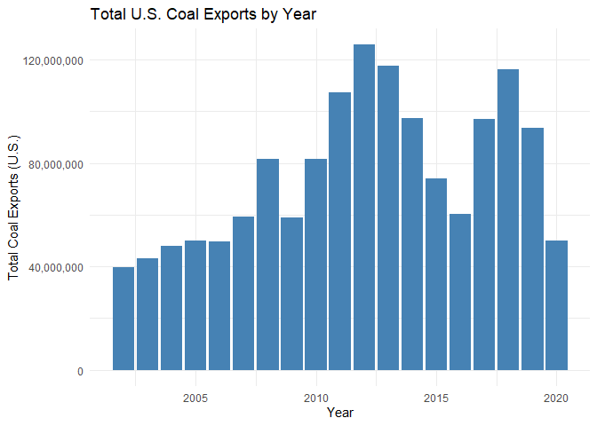
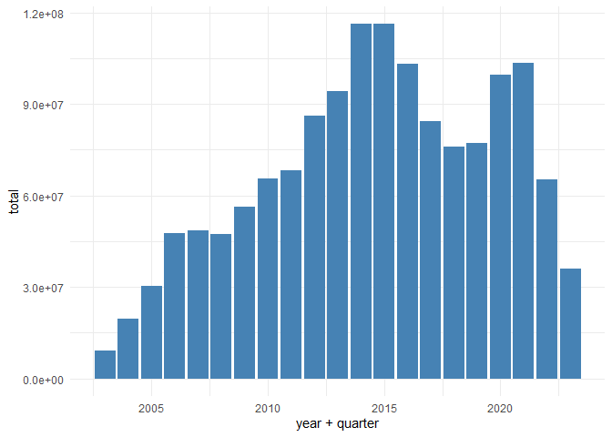
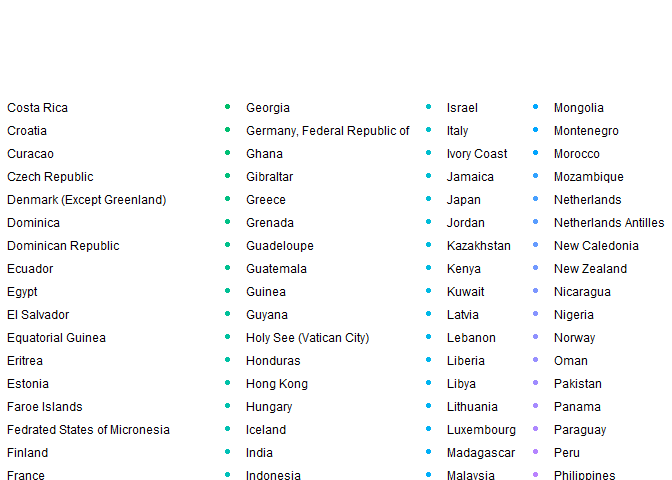

## Preliminaries: 

### Load libraries

It's a good idea to load your libraries at the top of the Rmd document so that everyone can see what you're using. Similarly, it's good practice to set `cache=FALSE` to ensure that the libraries are dynamically loaded each time you knit the document.

*Hint: I've only added the libraries needed to download and read the data. You'll need to load additional libraries to complete this assignment. Add them here once you discover that you need them.* 


```r
## Install the pacman package if necessary
if (!require("pacman")) install.packages("pacman")
```

```
## Warning: package 'pacman' was built under R version 4.0.5
```

```r
## Install other packages using pacman::p_load()
pacman::p_load(httr, readxl, here, dplyr, janitor, tidyverse, data.table)
```

### Read in the data

Use `httr::GET()` to fetch the EIA excel file for us from web. (We'll learn more about `httr`, GET and other HTTP methods when we get to webscraping next week.) 


```r
# library(here) ## Already loaded
# library(httr) ## Already loaded
url = "https://www.eia.gov/coal/archive/coal_historical_exports.xlsx"
## Only download the file if we need to
if(!file.exists(here::here("data/coal.xlsx"))) {
  GET(url, write_disk(here::here("data/coal.xlsx")))
}
```

Next, we read in the file.


```r
# library(readxl) Already loaded
coal = read_excel(here::here("data/coal.xlsx"), skip = 3, na = ".")
```

We are now ready to go.

## 1) Clean the column names

The column (i.e. variable) names aren't great: Spacing, uppercase letters, etc. 

```r
names(coal)
```

```
##  [1] "Year"                     "Quarter"                 
##  [3] "Type"                     "Customs District"        
##  [5] "Coal Origin Country"      "Coal Destination Country"
##  [7] "Steam Coal"               "Steam Revenue"           
##  [9] "Metallurgical"            "Metallurgical Revenue"   
## [11] "Total"                    "Total Revenue"           
## [13] "Coke"                     "Coke Revenue"
```

Clean them. 

*Hint: Use either `gsub()` and regular expressions or, more simply, the `janitor()` package. You will need to install the latter first.*


```r
coal_clean <- coal %>% 
  clean_names()

names(coal_clean)
```

```
##  [1] "year"                     "quarter"                 
##  [3] "type"                     "customs_district"        
##  [5] "coal_origin_country"      "coal_destination_country"
##  [7] "steam_coal"               "steam_revenue"           
##  [9] "metallurgical"            "metallurgical_revenue"   
## [11] "total"                    "total_revenue"           
## [13] "coke"                     "coke_revenue"
```


## 2) Total US coal exports over time (year only)

Plot the US's total coal exports over time by year ONLY. What secular trends do you notice in the data?

*Hints: If you want nicely formatted y-axis label, add `+ scale_y_continuous(labels = scales::comma)` to your `ggplot2` code.*

**Please put your (verbal) answers in bold.**


```r
# I get errors with both of these grouping functions. not sure yet what's wrong.

#coal_clean[
  #coal_origin_county = "United States",
 # sum(total, na.rm=T),
 # by = year
#]

#error goes away when I remove the filter function.

coal_clean %>% 
  #filter(coal_origin_county = "United States")
  group_by(year) %>%
  summarise(sum(total, na.rm = T))  
```

```
## # A tibble: 19 x 2
##     year `sum(total, na.rm = T)`
##    <dbl>                   <dbl>
##  1  2002                39601241
##  2  2003                43013508
##  3  2004                47997895
##  4  2005                49942211
##  5  2006                49647269
##  6  2007                59163103
##  7  2008                81519115
##  8  2009                59096951
##  9  2010                81715675
## 10  2011               107258561
## 11  2012               125745662
## 12  2013               117659268
## 13  2014                97256746
## 14  2015                73957888
## 15  2016                60271017
## 16  2017                96945119
## 17  2018               116244072
## 18  2019                93764651
## 19  2020                50006784
```

```r
#class(year)
  
plot<-ggplot(data=coal_clean, aes(x=year, y=total)) +
  geom_bar(stat="identity", fill="steelblue")+
  theme_minimal() + scale_y_continuous(labels = scales::comma) + labs(title = "Total U.S. Coal Exports by Year", x = "Year", y = "Total Coal Exports (U.S.)") 
plot
```

```
## Warning: Removed 1139 rows containing missing values (position_stack).
```

<!-- -->

**For the first 5 or 6 years there is little to no growth in coal exports, but it doesn't take off until 2008 where coal exports really increase. In 2012 U.S. coal exports peak before slowly decreasing over the next 4 years, and recovering in 2017/2018. It's likely that decreases in exports like in the years following 2012 are due to a decrease in demand for U.S. coal and an increase in demand for coal somewhere else. These trends can also be affected by improved green energy sources and people wanting to reduce carbon emissions due to climate change. We can see the effect that COVID-19 had on US coal exports as the virus was announced at the end of 2019 and much of the pandemic took place in 2020, which is where we see a very large decrease in coal exports from the U.S.**

## 3) Total US coal exports over time (year AND quarter)


```r
#Aggregate quarter year 
coal_clean2 <- coal_clean %>% unite(date, c("year", "quarter"), sep = "Q")

#sum total exports for each year and their respective quarter
coal_clean2 %>% 
  #filter(coal_origin_county = "United States")
  group_by(date) %>%
  summarise(sum(total, na.rm = T))  
```

```
## # A tibble: 75 x 2
##    date   `sum(total, na.rm = T)`
##    <chr>                    <dbl>
##  1 2002Q1                 9252584
##  2 2002Q2                11042519
##  3 2002Q3                 9256554
##  4 2002Q4                10049584
##  5 2003Q1                 8517778
##  6 2003Q2                11449798
##  7 2003Q3                12093944
##  8 2003Q4                10951988
##  9 2004Q1                 9688063
## 10 2004Q2                15255342
## # ... with 65 more rows
```

```r
#convert string to date ~ two potential solutions:lubridate and zoo
#if (!require("lubridate")) install.packages("lubridate")
#library(lubridate)

#if (!require("zoo")) install.packages("zoo")
#library(zoo)
#coal_clean2$year_quarter = as.yearqtr(coal_clean$date,format="%Yq%q")

plot2<-ggplot(data=coal_clean2, aes(x=date, y=total)) +
  geom_bar(stat="identity", fill="steelblue") +
  theme_minimal() + scale_y_continuous(labels = scales::comma) + 
  labs(title = "Total U.S. Coal Exports by Year", x = "Year-Quarter", y = "Total Coal Exports (U.S.)") +
  scale_x_discrete(guide = guide_axis(n.dodge=3, check.overlap = TRUE))
plot2
```

```
## Warning: Removed 1139 rows containing missing values (position_stack).
```

<!-- -->


Now do the same as the above, expect aggregated quarter of year (2001Q1, 2002Q2, etc.). Do you notice any seasonality that was masked from the yearly averages?

**I noticed that the first quarter typically had the lowest total export of the four quarters in most of the years, and this especially happened to be true early on but doesn't hold as much for the more recent years. There were significant decreases in total exports due to COVID which can really be seen starting at the beginning of 2020, and the second quarter is where we see a large drop in exports which was a four year low.**

*Hint: ggplot2 is going to want you to convert your quarterly data into actual date format before it plots nicely. (i.e. Don't leave it as a string.)*


## 4) Exports by destination country

### 4.1) Create a new data frame
Create a new data frame called `coal_country` that aggregates total exports by destination country (and quarter of year). Make sure you print the resulting data frame so that it appears in the knitted R markdown document.


```r
coal_country_missing_values <- coal_clean %>%
  arrange(coal_destination_country, year,quarter)
  head(coal_country_missing_values)
```

```
## # A tibble: 6 x 14
##    year quarter type    customs_district      coal_origin_cou~ coal_destination~
##   <dbl>   <dbl> <chr>   <chr>                 <chr>            <chr>            
## 1  2016       4 Coal E~ Houston-Galveston, TX United States    Albania          
## 2  2002       1 Coal E~ Houston-Galveston, TX United States    Algeria          
## 3  2002       1 Coal E~ Norfolk, VA / Mobile~ United States    Algeria          
## 4  2002       3 Coal E~ Norfolk, VA / Mobile~ United States    Algeria          
## 5  2002       4 Coal E~ Norfolk, VA / Mobile~ United States    Algeria          
## 6  2003       1 Coal E~ Norfolk, VA / Mobile~ United States    Algeria          
## # ... with 8 more variables: steam_coal <dbl>, steam_revenue <dbl>,
## #   metallurgical <dbl>, metallurgical_revenue <dbl>, total <dbl>,
## #   total_revenue <dbl>, coke <dbl>, coke_revenue <dbl>
```

#Here's just the two colums

```r
coal_country_Q4.1 <- coal_clean2 %>%
  group_by((coal_destination_country))%>%
  summarise(total = sum(total, na.rm = T))
  head(coal_country_Q4.1)
```

```
## # A tibble: 6 x 2
##   `(coal_destination_country)`   total
##   <chr>                          <dbl>
## 1 Albania                           74
## 2 Algeria                      2682655
## 3 Andorra                            9
## 4 Angola                         77151
## 5 Anguilla                          13
## 6 Antigua and Barbuda              205
```

### 4.2) Inspect the data frame

It looks like some countries are missing data for a number of years and periods (e.g. Albania). Confirm that this is the case. What do you think is happening here?

**4.2**   
2016 could be the first and only year coal was exported to Albania. Many countries could've chosen to invest/not invest in coal for many political and monetary reasons with the U.S. in different time periods. A reason that revenue is NA is it could be negative and then not reported to make their numbers look better to investors. Their revenue could be negative because the could have a negative price e.g. subside to jump start investing in U.S Coal. 2016 is also when President Trump was elected and claimed that he was going to "bring back coal jobs" and start using "cleaner coal" so there could have been discounted coal given to Albania to jump start this industry again. The main reason that values are missing is because when there wasn't coal transacted for a Quarter is wasn't recorded instead of recording NA for that quarter. 

### 4.3) Complete the data frame

Fill in the implicit missing values, so that each country has a representative row for every year-quarter time period. In other words, you should modify the data frame so that every destination country has row entries for all possible year-quarter combinations (from 2002Q1 through the most recent quarter). Order your updated data frame by country, year and, quarter. 

*Hints: See `?tidyr::complete()` for some convenience options. Again, don't forget to print `coal_country` after you've updated the data frame so that I can see the results.*

```r
coal_country <- coal_clean2 %>%  
  complete(coal_destination_country, date)
```


```r
head(coal_country)
```

```
## # A tibble: 6 x 13
##   coal_destination_co~ date  type  customs_district coal_origin_coun~ steam_coal
##   <chr>                <chr> <chr> <chr>            <chr>                  <dbl>
## 1 Albania              2002~ <NA>  <NA>             <NA>                      NA
## 2 Albania              2002~ <NA>  <NA>             <NA>                      NA
## 3 Albania              2002~ <NA>  <NA>             <NA>                      NA
## 4 Albania              2002~ <NA>  <NA>             <NA>                      NA
## 5 Albania              2003~ <NA>  <NA>             <NA>                      NA
## 6 Albania              2003~ <NA>  <NA>             <NA>                      NA
## # ... with 7 more variables: steam_revenue <dbl>, metallurgical <dbl>,
## #   metallurgical_revenue <dbl>, total <dbl>, total_revenue <dbl>, coke <dbl>,
## #   coke_revenue <dbl>
```


### 4.4 Some more tidying up

In answering the previous question, you _may_ encounter a situation where the data frame contains a quarter --- probably 2021q1 --- that is missing total export numbers for *all* countries. Did this happen to you? Filter out the completely missing quarter if so. Also: Why do you think this might have happened? (Please answer the latter question even if it didn't happen to you.) 

**4.4**  
This may have occurred because the our data set contained observations from 2002Q1 till 2020Q3. The complete function may have accidentally completed NA for all of Quarter 4 because we have zero observations recorded for the fourth quarter of 2020. 


### 4.5) Culmulative top 10 US coal export destinations

Produce a vector --- call it `coal10_culm` --- of the top 10 top coal destinations over the full 2002--`r `max(coal[, which(grepl('Year|year', names(coal)))], na.rm=T)` study period. What are they?


Produce a vector --- call it `coal10_culm` --- of the top 10 top coal destinations over the full 2002-2020 study period. What are they?


```r
top_10_cul_dt <- coal_country_Q4.1[with(coal_country_Q4.1, order(-total)),][1:10,]
setnames(top_10_cul_dt, old = c("(coal_destination_country)"), new = c("country"))

coal10_culm <- top_10_cul_dt %>% 
  pull(country)

view(coal10_culm)
```

**4.5**  
The top consuming coal countries are the following...
1. Canada  
2. Netherlands  
3. Brazil  
4. India  
5. South Korea (Republic of Korea)  
6. United Kingdom  
7. Japan  
8. Italy  
9. Germany, Federal Republic  
10. Mexico  
### 4.6) Recent top 10 US coal export destinations

Now do the same, except for most recent period on record (i.e. final quarter in the dataset). Call this vector `coal10_recent` and make sure to print it so that I can see it too. Are there any interesting differences between the two vectors? Apart from any secular trends, what else might explain these differences?

```r
# First I have to filter to just Quater 3 of 2020
top_10_rec_dt <- coal_clean2 %>%
                  filter(date=="2020Q3") %>%
                  group_by((coal_destination_country))%>%
                  summarise(total = sum(total, na.rm = T))
                  head(coal_country_Q4.1)
```

```
## # A tibble: 6 x 2
##   country               total
##   <chr>                 <dbl>
## 1 Albania                  74
## 2 Algeria             2682655
## 3 Andorra                   9
## 4 Angola                77151
## 5 Anguilla                 13
## 6 Antigua and Barbuda     205
```

```r
# Then reorder them and only show the top ten                  
top_10_rec_dt <- top_10_rec_dt[with(top_10_rec_dt, order(-total)),][1:10,]
setnames(top_10_rec_dt, old = c("(coal_destination_country)"), new = c("country"))
#Pull country as a vector
coal10_recent <- top_10_rec_dt %>% 
                  pull(country)

view(coal10_recent)
```

**4.6**  
The top consuming coal countries are the following...
1. India  
2. Brazil  
3. Netherlands  
4. Canada  
5. Japan  
6. South Korea (Republic of Korea)  
7. Turkey  
8. Ukraine  
9. Dominican Republic  
10.Austria  


The change in top coal consuming countries could've been because of other substitutes of energy becoming more accessible. I didn't notice any major changes. The top 4 remain top 4. I noticed a few European Countries were in the bottom 10 and didn't make the top 10 recent possible due to these large consumptious countries attempting though political power to convert to a more "sustainable" lifestyle. 

### 4.7) US coal exports over time by country

Plot the quarterly coal exports over time, but now disaggregated by country. In particular, highlight the top 10 (cumulative) export destinations and then sum the remaining countries into a combined "Other" category. (In other words, your figure should contain the time series of eleven different countries/categories.)


```r
plot4.7 <-ggplot(coal_clean2) +
            aes(x=date, y=total, size = total, col = coal_destination_country) +
            geom_point(stat="identity") +
            theme_classic() +
            labs(title = "Top U.S. Coal Exporting Countries by Year", x = "Year", y = "Total Coal Exported") +
            scale_y_continuous(labels = scales::comma) +
            scale_x_discrete(guide = guide_axis(n.dodge=3, check.overlap = TRUE))
plot4.7
```

```
## Warning: Removed 1139 rows containing missing values (geom_point).
```

<!-- -->


### 4.8) Make it pretty

Take your previous plot and add some swag to it. That is, try to make it as visually appealing as possible without overloading it with chart junk.

*Hint: You've got loads of options here. If you haven't already done so, consider a more bespoke theme with the `ggthemes`, `hrbrthemes`, or `cowplot` packages. Try out `scale_fill_brewer()` and `scale_colour_brewer()` for a range of interesting colour palettes. Try some transparency effects with `alpha`. Give your axis labels more refined names with the `labs()` layer in ggplot2. While you're at it, you might want to scale (i.e. normalise) your y-variable to get rid of all those zeros. You can shorten any country names to their ISO abbreviation; see `?countrycode::countrycode`. More substantively --- but more complicated --- you might want to re-order your legend (and the plot itself) according to the relative importance of the destination countries. See `?forcats::fct_reorder` or forcats::fct_relevel`.*


### 4.9) Make it interactive

Create an interactive version of your previous figure.

*Hint: Take a look at plotly::ggplotly(), or the gganimate package.*


## 5) Show me something interesting

There's a lot still to explore with this data set. Your final task is to show me something interesting. Drill down into the data and explain what's driving the secular trends that we have observed above. Or highlight interesting seasonality within a particular country. Or go back to the original `coal` data frame and look at exports by customs district, or by coal type. Do we changes or trends there? Etcetera. Etcetera. My only requirement is that you show your work and tell me what you have found.
