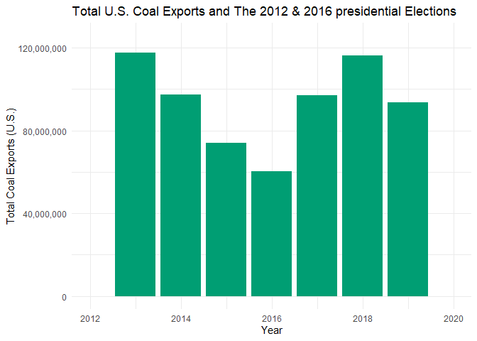

## Preliminaries: 

### Load libraries

It's a good idea to load your libraries at the top of the Rmd document so that everyone can see what you're using. Similarly, it's good practice to set `cache=FALSE` to ensure that the libraries are dynamically loaded each time you knit the document.

*Hint: I've only added the libraries needed to download and read the data. You'll need to load additional libraries to complete this assignment. Add them here once you discover that you need them.* 


```r
## Install the pacman package if necessary
if (!require("pacman")) install.packages("pacman")
```

```
## Warning: package 'pacman' was built under R version 4.0.5
```

```r
## Install other packages using pacman::p_load()
pacman::p_load(httr, readxl, here, dplyr, janitor, tidyverse, data.table, scales, gganimate, gapminder, plotly)
```

### Read in the data

Use `httr::GET()` to fetch the EIA excel file for us from web. (We'll learn more about `httr`, GET and other HTTP methods when we get to webscraping next week.) 


```r
# library(here) ## Already loaded
# library(httr) ## Already loaded
url = "https://www.eia.gov/coal/archive/coal_historical_exports.xlsx"
## Only download the file if we need to
if(!file.exists(here::here("data/coal.xlsx"))) {
  GET(url, write_disk(here::here("data/coal.xlsx")))
}
```

Next, we read in the file.


```r
# library(readxl) Already loaded
coal = read_excel(here::here("data/coal.xlsx"), skip = 3, na = ".")
```

We are now ready to go.

## 1) Clean the column names

The column (i.e. variable) names aren't great: Spacing, uppercase letters, etc. 

```r
names(coal)
```

```
##  [1] "Year"                     "Quarter"                 
##  [3] "Type"                     "Customs District"        
##  [5] "Coal Origin Country"      "Coal Destination Country"
##  [7] "Steam Coal"               "Steam Revenue"           
##  [9] "Metallurgical"            "Metallurgical Revenue"   
## [11] "Total"                    "Total Revenue"           
## [13] "Coke"                     "Coke Revenue"
```

Clean them. 

*Hint: Use either `gsub()` and regular expressions or, more simply, the `janitor()` package. You will need to install the latter first.*


```r
coal_clean <- coal %>% 
  clean_names()

names(coal_clean)
```

```
##  [1] "year"                     "quarter"                 
##  [3] "type"                     "customs_district"        
##  [5] "coal_origin_country"      "coal_destination_country"
##  [7] "steam_coal"               "steam_revenue"           
##  [9] "metallurgical"            "metallurgical_revenue"   
## [11] "total"                    "total_revenue"           
## [13] "coke"                     "coke_revenue"
```


## 2) Total US coal exports over time (year only)

Plot the US's total coal exports over time by year ONLY. What secular trends do you notice in the data?

*Hints: If you want nicely formatted y-axis label, add `+ scale_y_continuous(labels = scales::comma)` to your `ggplot2` code.*

**Please put your (verbal) answers in bold.**


```r
# I get errors with both of these grouping functions. not sure yet what's wrong.

#coal_clean[
  #coal_origin_county = "United States",
 # sum(total, na.rm=T),
 # by = year
#]

#error goes away when I remove the filter function.

coal_clean %>% 
  #filter(coal_origin_county = "United States")
  group_by(year) %>%
  summarise(sum(total, na.rm = T))  
```

```
## # A tibble: 19 x 2
##     year `sum(total, na.rm = T)`
##    <dbl>                   <dbl>
##  1  2002                39601241
##  2  2003                43013508
##  3  2004                47997895
##  4  2005                49942211
##  5  2006                49647269
##  6  2007                59163103
##  7  2008                81519115
##  8  2009                59096951
##  9  2010                81715675
## 10  2011               107258561
## 11  2012               125745662
## 12  2013               117659268
## 13  2014                97256746
## 14  2015                73957888
## 15  2016                60271017
## 16  2017                96945119
## 17  2018               116244072
## 18  2019                93764651
## 19  2020                50006784
```

```r
#class(year)
  
plot<-ggplot(data=coal_clean, aes(x=year, y=total)) +
  geom_bar(stat="identity", fill="steelblue")+
  theme_minimal() + scale_y_continuous(labels = scales::comma) + labs(title = "Total U.S. Coal Exports by Year", x = "Year", y = "Total Coal Exports (U.S.)") 
plot
```

```
## Warning: Removed 1139 rows containing missing values (position_stack).
```

<!-- -->

**For the first 5 or 6 years there is little to no growth in coal exports, but it doesn't take off until 2008 where coal exports really increase. In 2012 U.S. coal exports peak before slowly decreasing over the next 4 years, and recovering in 2017/2018. It's likely that decreases in exports like in the years following 2012 are due to a decrease in demand for U.S. coal and an increase in demand for coal somewhere else. These trends can also be affected by improved green energy sources and people wanting to reduce carbon emissions due to climate change. We can see the effect that COVID-19 had on US coal exports as the virus was announced at the end of 2019 and much of the pandemic took place in 2020, which is where we see a very large decrease in coal exports from the U.S.**

## 3) Total US coal exports over time (year AND quarter)


```r
#Aggregate quarter year 
coal_clean2 <- coal_clean %>% unite(date, c("year", "quarter"), sep = "Q")

#sum total exports for each year and their respective quarter
coal_clean2 %>% 
  #filter(coal_origin_county = "United States")
  group_by(date) %>%
  summarise(sum(total, na.rm = T))  
```

```
## # A tibble: 75 x 2
##    date   `sum(total, na.rm = T)`
##    <chr>                    <dbl>
##  1 2002Q1                 9252584
##  2 2002Q2                11042519
##  3 2002Q3                 9256554
##  4 2002Q4                10049584
##  5 2003Q1                 8517778
##  6 2003Q2                11449798
##  7 2003Q3                12093944
##  8 2003Q4                10951988
##  9 2004Q1                 9688063
## 10 2004Q2                15255342
## # ... with 65 more rows
```

```r
#convert string to date ~ two potential solutions:lubridate and zoo
#if (!require("lubridate")) install.packages("lubridate")
#library(lubridate)

#if (!require("zoo")) install.packages("zoo")
#library(zoo)
#coal_clean2$year_quarter = as.yearqtr(coal_clean$date,format="%Yq%q")

plot2<-ggplot(data=coal_clean2, aes(x=date, y=total)) +
  geom_bar(stat="identity", fill="#69b3a2") +
  theme_minimal() + scale_y_continuous(labels = scales::comma) + 
  labs(title = "Total U.S. Coal Exports by Year", x = "Year-Quarter", y = "Total Coal Exports (U.S.)") +
  scale_x_discrete(guide = guide_axis(n.dodge=3, check.overlap = TRUE))
plot2
```

```
## Warning: Removed 1139 rows containing missing values (position_stack).
```

<!-- -->


Now do the same as the above, expect aggregated quarter of year (2001Q1, 2002Q2, etc.). Do you notice any seasonality that was masked from the yearly averages?

**I noticed that the first quarter typically had the lowest total export of the four quarters in most of the years, and this especially happened to be true early on but doesn't hold as much for the more recent years. There were significant decreases in total exports due to COVID which can really be seen starting at the beginning of 2020, and the second quarter is where we see a large drop in exports which was a four year low.**


*Hint: ggplot2 is going to want you to convert your quarterly data into actual date format before it plots nicely. (i.e. Don't leave it as a string.)*


## 4) Exports by destination country

### 4.1) Create a new data frame
Create a new data frame called `coal_country` that aggregates total exports by destination country (and quarter of year). Make sure you print the resulting data frame so that it appears in the knitted R markdown document.


```r
coal_country_missing_values <- coal_clean %>%
  arrange(coal_destination_country, year,quarter)
  head(coal_country_missing_values)
```

```
## # A tibble: 6 x 14
##    year quarter type    customs_district      coal_origin_cou~ coal_destination~
##   <dbl>   <dbl> <chr>   <chr>                 <chr>            <chr>            
## 1  2016       4 Coal E~ Houston-Galveston, TX United States    Albania          
## 2  2002       1 Coal E~ Houston-Galveston, TX United States    Algeria          
## 3  2002       1 Coal E~ Norfolk, VA / Mobile~ United States    Algeria          
## 4  2002       3 Coal E~ Norfolk, VA / Mobile~ United States    Algeria          
## 5  2002       4 Coal E~ Norfolk, VA / Mobile~ United States    Algeria          
## 6  2003       1 Coal E~ Norfolk, VA / Mobile~ United States    Algeria          
## # ... with 8 more variables: steam_coal <dbl>, steam_revenue <dbl>,
## #   metallurgical <dbl>, metallurgical_revenue <dbl>, total <dbl>,
## #   total_revenue <dbl>, coke <dbl>, coke_revenue <dbl>
```

#Here's just the two colums

```r
coal_country_Q4.1 <- coal_clean2 %>%
  group_by((coal_destination_country))%>%
  summarise(total = sum(total, na.rm = T))
  head(coal_country_Q4.1)
```

```
## # A tibble: 6 x 2
##   `(coal_destination_country)`   total
##   <chr>                          <dbl>
## 1 Albania                           74
## 2 Algeria                      2682655
## 3 Andorra                            9
## 4 Angola                         77151
## 5 Anguilla                          13
## 6 Antigua and Barbuda              205
```

### 4.2) Inspect the data frame

It looks like some countries are missing data for a number of years and periods (e.g. Albania). Confirm that this is the case. What do you think is happening here?

**4.2**   
2016 could be the first and only year coal was exported to Albania. Many countries could've chosen to invest/not invest in coal for many political and monetary reasons with the U.S. in different time periods. A reason that revenue is NA is it could be negative and then not reported to make their numbers look better to investors. Their revenue could be negative because the could have a negative price e.g. subside to jump start investing in U.S Coal. 2016 is also when President Trump was elected and claimed that he was going to "bring back coal jobs" and start using "cleaner coal" so there could have been discounted coal given to Albania to jump start this industry again. The main reason that values are missing is because when there wasn't coal transacted for a Quarter is wasn't recorded instead of recording NA for that quarter. 

### 4.3) Complete the data frame

Fill in the implicit missing values, so that each country has a representative row for every year-quarter time period. In other words, you should modify the data frame so that every destination country has row entries for all possible year-quarter combinations (from 2002Q1 through the most recent quarter). Order your updated data frame by country, year and, quarter. 

*Hints: See `?tidyr::complete()` for some convenience options. Again, don't forget to print `coal_country` after you've updated the data frame so that I can see the results.*

```r
coal_country <- coal_clean2 %>%  
  complete(coal_destination_country, date)
```


```r
coal_country
```

```
## # A tibble: 17,590 x 13
##    coal_destination_c~ date  type  customs_district coal_origin_coun~ steam_coal
##    <chr>               <chr> <chr> <chr>            <chr>                  <dbl>
##  1 Albania             2002~ <NA>  <NA>             <NA>                      NA
##  2 Albania             2002~ <NA>  <NA>             <NA>                      NA
##  3 Albania             2002~ <NA>  <NA>             <NA>                      NA
##  4 Albania             2002~ <NA>  <NA>             <NA>                      NA
##  5 Albania             2003~ <NA>  <NA>             <NA>                      NA
##  6 Albania             2003~ <NA>  <NA>             <NA>                      NA
##  7 Albania             2003~ <NA>  <NA>             <NA>                      NA
##  8 Albania             2003~ <NA>  <NA>             <NA>                      NA
##  9 Albania             2004~ <NA>  <NA>             <NA>                      NA
## 10 Albania             2004~ <NA>  <NA>             <NA>                      NA
## # ... with 17,580 more rows, and 7 more variables: steam_revenue <dbl>,
## #   metallurgical <dbl>, metallurgical_revenue <dbl>, total <dbl>,
## #   total_revenue <dbl>, coke <dbl>, coke_revenue <dbl>
```


### 4.4 Some more tidying up

In answering the previous question, you _may_ encounter a situation where the data frame contains a quarter --- probably 2021q1 --- that is missing total export numbers for *all* countries. Did this happen to you? Filter out the completely missing quarter if so. Also: Why do you think this might have happened? (Please answer the latter question even if it didn't happen to you.) 

**4.4**  
This may have occurred because the our data set contained observations from 2002Q1 till 2020Q3. The complete function may have accidentally completed NA for all of Quarter 4 because we have zero observations recorded for the fourth quarter of 2020. 


### 4.5) Culmulative top 10 US coal export destinations

Produce a vector --- call it `coal10_culm` --- of the top 10 top coal destinations over the full 2002--`r `max(coal[, which(grepl('Year|year', names(coal)))], na.rm=T)` study period. What are they?


Produce a vector --- call it `coal10_culm` --- of the top 10 top coal destinations over the full 2002-2020 study period. What are they?


```r
top_10_cul_dt <- coal_country_Q4.1[with(coal_country_Q4.1, order(-total)),][1:10,]
setnames(top_10_cul_dt, old = c("(coal_destination_country)"), new = c("country"))

coal10_culm <- top_10_cul_dt %>% 
  pull(country)

view(coal10_culm)
#sometimes I ran into some errors and had to tag line 217 and 251
```

**4.5**  
The top consuming coal countries are the following...
1. Canada  
2. Netherlands  
3. Brazil  
4. India  
5. South Korea (Republic of Korea)  
6. United Kingdom  
7. Japan  
8. Italy  
9. Germany, Federal Republic  
10. Mexico  
### 4.6) Recent top 10 US coal export destinations

Now do the same, except for most recent period on record (i.e. final quarter in the dataset). Call this vector `coal10_recent` and make sure to print it so that I can see it too. Are there any interesting differences between the two vectors? Apart from any secular trends, what else might explain these differences?


```r
# First I have to filter to just Quarter 3 of 2020
top_10_rec_dt <- coal_clean2 %>%
                  filter(date=="2020Q3") %>%
                  group_by((coal_destination_country))%>%
                  summarise(total = sum(total, na.rm = T))
                  head(top_10_rec_dt)
```

```
## # A tibble: 6 x 2
##   `(coal_destination_country)`   total
##   <chr>                          <dbl>
## 1 Argentina                     161213
## 2 Australia                        137
## 3 Austria                       347551
## 4 Belgium                       155773
## 5 Brazil                       2103045
## 6 Cambodia                           6
```

```r
# Then reorder them and only show the top ten                  
top_10_rec_dt <- top_10_rec_dt[with(top_10_rec_dt, order(-total)),][1:10,]
setnames(top_10_rec_dt, old = c("(coal_destination_country)"), new = c("country"))
#Pull country as a vector
coal10_recent <- top_10_rec_dt %>% 
                  pull(country)

view(coal10_recent)
#sometimes I ran into some errors and had to tag line 217 and 251
```

**4.6**  
The top consuming coal countries are the following...
1. India  
2. Brazil  
3. Netherlands  
4. Canada  
5. Japan  
6. South Korea (Republic of Korea)  
7. Turkey  
8. Ukraine  
9. Dominican Republic  
10.Austria  


The change in top coal consuming countries could've been because of other substitutes of energy becoming more accessible. I didn't notice any major changes. The top 4 remain top 4. I noticed a few European Countries were in the bottom 10 and didn't make the top 10 recent possible due to these large consumptious countries attempting though political power to convert to a more "sustainable" lifestyle. 

### 4.7) US coal exports over time by country

Plot the quarterly coal exports over time, but now disaggregated by country. In particular, highlight the top 10 (cumulative) export destinations and then sum the remaining countries into a combined "Other" category. (In other words, your figure should contain the time series of eleven different countries/categories.)


```r
# ALL_top_10_cul_dt <- coal_country_Q4.1[with(coal_country_Q4.1, order(-total)),][]
# OTHER_top_10_cul_dt <- coal_country_Q4.1[with(coal_country_Q4.1, order(-total)),][11:151,]

other_coal_dt <- coal_clean2 %>%
  mutate(coal_destination_country=ifelse(coal_destination_country %in% coal10_culm, coal_destination_country, "Other Countries")) %>%
  group_by(date, coal_destination_country) %>%
  summarise(total = sum(total, na.rm = T))

plot4.7 <-ggplot(other_coal_dt) +
            aes(x=date, y=total, col = coal_destination_country, label = coal_destination_country) +
            geom_point() +
            geom_line(stat="identity") +
            theme_classic() +
            scale_x_discrete(guide = guide_axis(n.dodge=3, check.overlap = TRUE))
plot4.7
```

<!-- -->

### 4.8) Make it pretty

Take your previous plot and add some swag to it. That is, try to make it as visually appealing as possible without overloading it with chart junk.

*Hint: You've got loads of options here. If you haven't already done so, consider a more bespoke theme with the `ggthemes`, `hrbrthemes`, or `cowplot` packages. Try out `scale_fill_brewer()` and `scale_colour_brewer()` for a range of interesting colour palettes. Try some transparency effects with `alpha`. Give your axis labels more refined names with the `labs()` layer in ggplot2. While you're at it, you might want to scale (i.e. normalise) your y-variable to get rid of all those zeros. You can shorten any country names to their ISO abbreviation; see `?countrycode::countrycode`. More substantively --- but more complicated --- you might want to re-order your legend (and the plot itself) according to the relative importance of the destination countries. See `?forcats::fct_reorder` or forcats::fct_relevel`.*

**GitHub wouldn't run geom_smooth for some reason**

```r
plot4.8 <-ggplot(other_coal_dt) +
            aes(x=date, y=total, col = coal_destination_country, label = coal_destination_country) +
            geom_point() +
            geom_line(stat="identity") +
            theme_dark() +
            labs(title = "Top U.S. Coal Exporting Countries by Year from 2002-2020", x = "Year and Quarter", y = "Total Coal Exported") +
            theme(legend.position="right", legend.box.background = element_rect(fill="lightblue", size=2.5, linetype="solid", colour ="darkblue")) +
            scale_y_continuous(labels = scales::comma) +
            scale_fill_brewer(palette = "Set1") +
            scale_x_discrete(guide = guide_axis(n.dodge=3, check.overlap = TRUE))
plot4.8
```

<!-- -->


### 4.9) Make it interactive

Create an interactive version of your previous figure.

*Hint: Take a look at plotly::ggplotly(), or the gganimate package.*

#First i'm going to seperate the data

```r
animate_dt <- other_coal_dt %>%
  separate(date, c("year", "quarter"), sep = "Q")
```

#Plot 4.9

```r
plot4.9 <-ggplot(animate_dt) +
            aes(x=date, y=total, col = coal_destination_country, label = coal_destination_country) +
            geom_point() +
            geom_line(stat="identity") +
            theme_light() +
            theme(legend.position="right", legend.box.background = element_rect(fill="lightblue", linetype="solid", colour ="darkblue")) +
            scale_y_continuous(labels = scales::comma) +
            labs(title = 'year: {frame_time}', x = 'year', y = 'total') +
            transition_time(year) +
            ease_aes('linear')

           
#animate(plot4.9)
```


```r
fig <- animate_dt %>%
  plot_ly(
    x = ~year, 
    y = ~total, 
    color = ~coal_destination_country, 
    frame = ~year, 
    text = ~'CoalExported', 
    hoverinfo = "text",
    type = 'scatter',
    mode = 'markers'
  )
fig <- fig %>% layout(
    xaxis = list(
      type = "log"
    )
  )

fig
```

```
## Warning in RColorBrewer::brewer.pal(N, "Set2"): n too large, allowed maximum for palette Set2 is 8
## Returning the palette you asked for with that many colors

## Warning in RColorBrewer::brewer.pal(N, "Set2"): n too large, allowed maximum for palette Set2 is 8
## Returning the palette you asked for with that many colors
```

```{=html}
<div id="htmlwidget-a1c299648b56113c861d" style="width:672px;height:480px;" class="plotly html-widget"></div>
<script type="application/json" data-for="htmlwidget-a1c299648b56113c861d">{"x":{"visdat":{"51542874644f":["function () ","plotlyVisDat"]},"cur_data":"51542874644f","attrs":{"51542874644f":{"x":{},"y":{},"text":{},"hoverinfo":"text","mode":"markers","color":{},"frame":{},"alpha_stroke":1,"sizes":[10,100],"spans":[1,20],"type":"scatter"}},"layout":{"margin":{"b":40,"l":60,"t":25,"r":10},"xaxis":{"domain":[0,1],"automargin":true,"type":"log","title":"year","categoryorder":"array","categoryarray":["2002","2003","2004","2005","2006","2007","2008","2009","2010","2011","2012","2013","2014","2015","2016","2017","2018","2019","2020"]},"yaxis":{"domain":[0,1],"automargin":true,"title":"total","range":[-810908,17029244]},"hovermode":"closest","showlegend":true,"sliders":[{"currentvalue":{"prefix":"year: ","xanchor":"right","font":{"size":16,"color":"rgba(204,204,204,1)"}},"steps":[{"method":"animate","args":[["2002"],{"transition":{"duration":500,"easing":"linear"},"frame":{"duration":500,"redraw":false},"mode":"immediate"}],"label":"2002","value":"2002"},{"method":"animate","args":[["2003"],{"transition":{"duration":500,"easing":"linear"},"frame":{"duration":500,"redraw":false},"mode":"immediate"}],"label":"2003","value":"2003"},{"method":"animate","args":[["2004"],{"transition":{"duration":500,"easing":"linear"},"frame":{"duration":500,"redraw":false},"mode":"immediate"}],"label":"2004","value":"2004"},{"method":"animate","args":[["2005"],{"transition":{"duration":500,"easing":"linear"},"frame":{"duration":500,"redraw":false},"mode":"immediate"}],"label":"2005","value":"2005"},{"method":"animate","args":[["2006"],{"transition":{"duration":500,"easing":"linear"},"frame":{"duration":500,"redraw":false},"mode":"immediate"}],"label":"2006","value":"2006"},{"method":"animate","args":[["2007"],{"transition":{"duration":500,"easing":"linear"},"frame":{"duration":500,"redraw":false},"mode":"immediate"}],"label":"2007","value":"2007"},{"method":"animate","args":[["2008"],{"transition":{"duration":500,"easing":"linear"},"frame":{"duration":500,"redraw":false},"mode":"immediate"}],"label":"2008","value":"2008"},{"method":"animate","args":[["2009"],{"transition":{"duration":500,"easing":"linear"},"frame":{"duration":500,"redraw":false},"mode":"immediate"}],"label":"2009","value":"2009"},{"method":"animate","args":[["2010"],{"transition":{"duration":500,"easing":"linear"},"frame":{"duration":500,"redraw":false},"mode":"immediate"}],"label":"2010","value":"2010"},{"method":"animate","args":[["2011"],{"transition":{"duration":500,"easing":"linear"},"frame":{"duration":500,"redraw":false},"mode":"immediate"}],"label":"2011","value":"2011"},{"method":"animate","args":[["2012"],{"transition":{"duration":500,"easing":"linear"},"frame":{"duration":500,"redraw":false},"mode":"immediate"}],"label":"2012","value":"2012"},{"method":"animate","args":[["2013"],{"transition":{"duration":500,"easing":"linear"},"frame":{"duration":500,"redraw":false},"mode":"immediate"}],"label":"2013","value":"2013"},{"method":"animate","args":[["2014"],{"transition":{"duration":500,"easing":"linear"},"frame":{"duration":500,"redraw":false},"mode":"immediate"}],"label":"2014","value":"2014"},{"method":"animate","args":[["2015"],{"transition":{"duration":500,"easing":"linear"},"frame":{"duration":500,"redraw":false},"mode":"immediate"}],"label":"2015","value":"2015"},{"method":"animate","args":[["2016"],{"transition":{"duration":500,"easing":"linear"},"frame":{"duration":500,"redraw":false},"mode":"immediate"}],"label":"2016","value":"2016"},{"method":"animate","args":[["2017"],{"transition":{"duration":500,"easing":"linear"},"frame":{"duration":500,"redraw":false},"mode":"immediate"}],"label":"2017","value":"2017"},{"method":"animate","args":[["2018"],{"transition":{"duration":500,"easing":"linear"},"frame":{"duration":500,"redraw":false},"mode":"immediate"}],"label":"2018","value":"2018"},{"method":"animate","args":[["2019"],{"transition":{"duration":500,"easing":"linear"},"frame":{"duration":500,"redraw":false},"mode":"immediate"}],"label":"2019","value":"2019"},{"method":"animate","args":[["2020"],{"transition":{"duration":500,"easing":"linear"},"frame":{"duration":500,"redraw":false},"mode":"immediate"}],"label":"2020","value":"2020"}],"visible":true,"pad":{"t":40}}],"updatemenus":[{"type":"buttons","direction":"right","showactive":false,"y":0,"x":0,"yanchor":"top","xanchor":"right","pad":{"t":60,"r":5},"buttons":[{"label":"Play","method":"animate","args":[null,{"fromcurrent":true,"mode":"immediate","transition":{"duration":500,"easing":"linear"},"frame":{"duration":500,"redraw":false}}]}]}]},"source":"A","config":{"showSendToCloud":false},"data":[{"x":["2002","2002","2002","2002"],"y":[709171,914655,860271,1054140],"text":["CoalExported","CoalExported","CoalExported","CoalExported"],"hoverinfo":["text","text","text","text"],"mode":"markers","frame":"2002","type":"scatter","name":"Brazil","marker":{"color":"rgba(102,194,165,1)","line":{"color":"rgba(102,194,165,1)"}},"textfont":{"color":"rgba(102,194,165,1)"},"error_y":{"color":"rgba(102,194,165,1)"},"error_x":{"color":"rgba(102,194,165,1)"},"line":{"color":"rgba(102,194,165,1)"},"xaxis":"x","yaxis":"y","visible":true},{"x":["2002","2002","2002","2002"],"y":[2270612,4995241,4299499,5120223],"text":["CoalExported","CoalExported","CoalExported","CoalExported"],"hoverinfo":["text","text","text","text"],"mode":"markers","frame":"2002","type":"scatter","name":"Canada","marker":{"color":"rgba(219,161,118,1)","line":{"color":"rgba(219,161,118,1)"}},"textfont":{"color":"rgba(219,161,118,1)"},"error_y":{"color":"rgba(219,161,118,1)"},"error_x":{"color":"rgba(219,161,118,1)"},"line":{"color":"rgba(219,161,118,1)"},"xaxis":"x","yaxis":"y","visible":true},{"x":["2002","2002","2002"],"y":[236519,720683,892],"text":["CoalExported","CoalExported","CoalExported"],"hoverinfo":["text","text","text"],"mode":"markers","frame":"2002","type":"scatter","name":"Germany, Federal Republic of","marker":{"color":"rgba(217,150,141,1)","line":{"color":"rgba(217,150,141,1)"}},"textfont":{"color":"rgba(217,150,141,1)"},"error_y":{"color":"rgba(217,150,141,1)"},"error_x":{"color":"rgba(217,150,141,1)"},"line":{"color":"rgba(217,150,141,1)"},"xaxis":"x","yaxis":"y","visible":true},{"x":["2002","2002","2002"],"y":[179,9914,535],"text":["CoalExported","CoalExported","CoalExported"],"hoverinfo":["text","text","text"],"mode":"markers","frame":"2002","type":"scatter","name":"India","marker":{"color":"rgba(152,158,202,1)","line":{"color":"rgba(152,158,202,1)"}},"textfont":{"color":"rgba(152,158,202,1)"},"error_y":{"color":"rgba(152,158,202,1)"},"error_x":{"color":"rgba(152,158,202,1)"},"line":{"color":"rgba(152,158,202,1)"},"xaxis":"x","yaxis":"y","visible":true},{"x":["2002","2002","2002","2002"],"y":[1301863,753940,550186,471380],"text":["CoalExported","CoalExported","CoalExported","CoalExported"],"hoverinfo":["text","text","text","text"],"mode":"markers","frame":"2002","type":"scatter","name":"Italy","marker":{"color":"rgba(215,144,197,1)","line":{"color":"rgba(215,144,197,1)"}},"textfont":{"color":"rgba(215,144,197,1)"},"error_y":{"color":"rgba(215,144,197,1)"},"error_x":{"color":"rgba(215,144,197,1)"},"line":{"color":"rgba(215,144,197,1)"},"xaxis":"x","yaxis":"y","visible":true},{"x":["2002","2002","2002","2002"],"y":[1033756,218172,339,1042],"text":["CoalExported","CoalExported","CoalExported","CoalExported"],"hoverinfo":["text","text","text","text"],"mode":"markers","frame":"2002","type":"scatter","name":"Japan","marker":{"color":"rgba(205,180,144,1)","line":{"color":"rgba(205,180,144,1)"}},"textfont":{"color":"rgba(205,180,144,1)"},"error_y":{"color":"rgba(205,180,144,1)"},"error_x":{"color":"rgba(205,180,144,1)"},"line":{"color":"rgba(205,180,144,1)"},"xaxis":"x","yaxis":"y","visible":true},{"x":["2002","2002","2002","2002"],"y":[147964,193652,286164,169827],"text":["CoalExported","CoalExported","CoalExported","CoalExported"],"hoverinfo":["text","text","text","text"],"mode":"markers","frame":"2002","type":"scatter","name":"Mexico","marker":{"color":"rgba(186,217,78,1)","line":{"color":"rgba(186,217,78,1)"}},"textfont":{"color":"rgba(186,217,78,1)"},"error_y":{"color":"rgba(186,217,78,1)"},"error_x":{"color":"rgba(186,217,78,1)"},"line":{"color":"rgba(186,217,78,1)"},"xaxis":"x","yaxis":"y","visible":true},{"x":["2002","2002","2002","2002"],"y":[453065,512883,386329,297290],"text":["CoalExported","CoalExported","CoalExported","CoalExported"],"hoverinfo":["text","text","text","text"],"mode":"markers","frame":"2002","type":"scatter","name":"Netherlands","marker":{"color":"rgba(247,217,52,1)","line":{"color":"rgba(247,217,52,1)"}},"textfont":{"color":"rgba(247,217,52,1)"},"error_y":{"color":"rgba(247,217,52,1)"},"error_x":{"color":"rgba(247,217,52,1)"},"line":{"color":"rgba(247,217,52,1)"},"xaxis":"x","yaxis":"y","visible":true},{"x":["2002","2002","2002","2002"],"y":[2457649,2095996,2261764,2612531],"text":["CoalExported","CoalExported","CoalExported","CoalExported"],"hoverinfo":["text","text","text","text"],"mode":"markers","frame":"2002","type":"scatter","name":"Other Countries","marker":{"color":"rgba(241,204,114,1)","line":{"color":"rgba(241,204,114,1)"}},"textfont":{"color":"rgba(241,204,114,1)"},"error_y":{"color":"rgba(241,204,114,1)"},"error_x":{"color":"rgba(241,204,114,1)"},"line":{"color":"rgba(241,204,114,1)"},"xaxis":"x","yaxis":"y","visible":true},{"x":["2002","2002","2002","2002"],"y":[67088,80008,84030,69597],"text":["CoalExported","CoalExported","CoalExported","CoalExported"],"hoverinfo":["text","text","text","text"],"mode":"markers","frame":"2002","type":"scatter","name":"South Korea (Republic of Korea)","marker":{"color":"rgba(215,191,158,1)","line":{"color":"rgba(215,191,158,1)"}},"textfont":{"color":"rgba(215,191,158,1)"},"error_y":{"color":"rgba(215,191,158,1)"},"error_x":{"color":"rgba(215,191,158,1)"},"line":{"color":"rgba(215,191,158,1)"},"xaxis":"x","yaxis":"y","visible":true},{"x":["2002","2002","2002","2002"],"y":[574718,547375,527080,253019],"text":["CoalExported","CoalExported","CoalExported","CoalExported"],"hoverinfo":["text","text","text","text"],"mode":"markers","frame":"2002","type":"scatter","name":"United Kingdom","marker":{"color":"rgba(179,179,179,1)","line":{"color":"rgba(179,179,179,1)"}},"textfont":{"color":"rgba(179,179,179,1)"},"error_y":{"color":"rgba(179,179,179,1)"},"error_x":{"color":"rgba(179,179,179,1)"},"line":{"color":"rgba(179,179,179,1)"},"xaxis":"x","yaxis":"y","visible":true}],"highlight":{"on":"plotly_click","persistent":false,"dynamic":false,"selectize":false,"opacityDim":0.2,"selected":{"opacity":1},"debounce":0},"frames":[{"name":"2002","data":[{"x":["2002","2002","2002","2002"],"y":[709171,914655,860271,1054140],"text":["CoalExported","CoalExported","CoalExported","CoalExported"],"hoverinfo":["text","text","text","text"],"mode":"markers","frame":"2002","type":"scatter","name":"Brazil","marker":{"color":"rgba(102,194,165,1)","line":{"color":"rgba(102,194,165,1)"}},"textfont":{"color":"rgba(102,194,165,1)"},"error_y":{"color":"rgba(102,194,165,1)"},"error_x":{"color":"rgba(102,194,165,1)"},"line":{"color":"rgba(102,194,165,1)"},"xaxis":"x","yaxis":"y","visible":true},{"x":["2002","2002","2002","2002"],"y":[2270612,4995241,4299499,5120223],"text":["CoalExported","CoalExported","CoalExported","CoalExported"],"hoverinfo":["text","text","text","text"],"mode":"markers","frame":"2002","type":"scatter","name":"Canada","marker":{"color":"rgba(219,161,118,1)","line":{"color":"rgba(219,161,118,1)"}},"textfont":{"color":"rgba(219,161,118,1)"},"error_y":{"color":"rgba(219,161,118,1)"},"error_x":{"color":"rgba(219,161,118,1)"},"line":{"color":"rgba(219,161,118,1)"},"xaxis":"x","yaxis":"y","visible":true},{"x":["2002","2002","2002"],"y":[236519,720683,892],"text":["CoalExported","CoalExported","CoalExported"],"hoverinfo":["text","text","text"],"mode":"markers","frame":"2002","type":"scatter","name":"Germany, Federal Republic of","marker":{"color":"rgba(217,150,141,1)","line":{"color":"rgba(217,150,141,1)"}},"textfont":{"color":"rgba(217,150,141,1)"},"error_y":{"color":"rgba(217,150,141,1)"},"error_x":{"color":"rgba(217,150,141,1)"},"line":{"color":"rgba(217,150,141,1)"},"xaxis":"x","yaxis":"y","visible":true},{"x":["2002","2002","2002"],"y":[179,9914,535],"text":["CoalExported","CoalExported","CoalExported"],"hoverinfo":["text","text","text"],"mode":"markers","frame":"2002","type":"scatter","name":"India","marker":{"color":"rgba(152,158,202,1)","line":{"color":"rgba(152,158,202,1)"}},"textfont":{"color":"rgba(152,158,202,1)"},"error_y":{"color":"rgba(152,158,202,1)"},"error_x":{"color":"rgba(152,158,202,1)"},"line":{"color":"rgba(152,158,202,1)"},"xaxis":"x","yaxis":"y","visible":true},{"x":["2002","2002","2002","2002"],"y":[1301863,753940,550186,471380],"text":["CoalExported","CoalExported","CoalExported","CoalExported"],"hoverinfo":["text","text","text","text"],"mode":"markers","frame":"2002","type":"scatter","name":"Italy","marker":{"color":"rgba(215,144,197,1)","line":{"color":"rgba(215,144,197,1)"}},"textfont":{"color":"rgba(215,144,197,1)"},"error_y":{"color":"rgba(215,144,197,1)"},"error_x":{"color":"rgba(215,144,197,1)"},"line":{"color":"rgba(215,144,197,1)"},"xaxis":"x","yaxis":"y","visible":true},{"x":["2002","2002","2002","2002"],"y":[1033756,218172,339,1042],"text":["CoalExported","CoalExported","CoalExported","CoalExported"],"hoverinfo":["text","text","text","text"],"mode":"markers","frame":"2002","type":"scatter","name":"Japan","marker":{"color":"rgba(205,180,144,1)","line":{"color":"rgba(205,180,144,1)"}},"textfont":{"color":"rgba(205,180,144,1)"},"error_y":{"color":"rgba(205,180,144,1)"},"error_x":{"color":"rgba(205,180,144,1)"},"line":{"color":"rgba(205,180,144,1)"},"xaxis":"x","yaxis":"y","visible":true},{"x":["2002","2002","2002","2002"],"y":[147964,193652,286164,169827],"text":["CoalExported","CoalExported","CoalExported","CoalExported"],"hoverinfo":["text","text","text","text"],"mode":"markers","frame":"2002","type":"scatter","name":"Mexico","marker":{"color":"rgba(186,217,78,1)","line":{"color":"rgba(186,217,78,1)"}},"textfont":{"color":"rgba(186,217,78,1)"},"error_y":{"color":"rgba(186,217,78,1)"},"error_x":{"color":"rgba(186,217,78,1)"},"line":{"color":"rgba(186,217,78,1)"},"xaxis":"x","yaxis":"y","visible":true},{"x":["2002","2002","2002","2002"],"y":[453065,512883,386329,297290],"text":["CoalExported","CoalExported","CoalExported","CoalExported"],"hoverinfo":["text","text","text","text"],"mode":"markers","frame":"2002","type":"scatter","name":"Netherlands","marker":{"color":"rgba(247,217,52,1)","line":{"color":"rgba(247,217,52,1)"}},"textfont":{"color":"rgba(247,217,52,1)"},"error_y":{"color":"rgba(247,217,52,1)"},"error_x":{"color":"rgba(247,217,52,1)"},"line":{"color":"rgba(247,217,52,1)"},"xaxis":"x","yaxis":"y","visible":true},{"x":["2002","2002","2002","2002"],"y":[2457649,2095996,2261764,2612531],"text":["CoalExported","CoalExported","CoalExported","CoalExported"],"hoverinfo":["text","text","text","text"],"mode":"markers","frame":"2002","type":"scatter","name":"Other Countries","marker":{"color":"rgba(241,204,114,1)","line":{"color":"rgba(241,204,114,1)"}},"textfont":{"color":"rgba(241,204,114,1)"},"error_y":{"color":"rgba(241,204,114,1)"},"error_x":{"color":"rgba(241,204,114,1)"},"line":{"color":"rgba(241,204,114,1)"},"xaxis":"x","yaxis":"y","visible":true},{"x":["2002","2002","2002","2002"],"y":[67088,80008,84030,69597],"text":["CoalExported","CoalExported","CoalExported","CoalExported"],"hoverinfo":["text","text","text","text"],"mode":"markers","frame":"2002","type":"scatter","name":"South Korea (Republic of Korea)","marker":{"color":"rgba(215,191,158,1)","line":{"color":"rgba(215,191,158,1)"}},"textfont":{"color":"rgba(215,191,158,1)"},"error_y":{"color":"rgba(215,191,158,1)"},"error_x":{"color":"rgba(215,191,158,1)"},"line":{"color":"rgba(215,191,158,1)"},"xaxis":"x","yaxis":"y","visible":true},{"x":["2002","2002","2002","2002"],"y":[574718,547375,527080,253019],"text":["CoalExported","CoalExported","CoalExported","CoalExported"],"hoverinfo":["text","text","text","text"],"mode":"markers","frame":"2002","type":"scatter","name":"United Kingdom","marker":{"color":"rgba(179,179,179,1)","line":{"color":"rgba(179,179,179,1)"}},"textfont":{"color":"rgba(179,179,179,1)"},"error_y":{"color":"rgba(179,179,179,1)"},"error_x":{"color":"rgba(179,179,179,1)"},"line":{"color":"rgba(179,179,179,1)"},"xaxis":"x","yaxis":"y","visible":true}],"traces":[0,1,2,3,4,5,6,7,8,9,10]},{"name":"2003","data":[{"x":["2003","2003","2003","2003"],"y":[984832,937500,544679,1047062],"text":["CoalExported","CoalExported","CoalExported","CoalExported"],"hoverinfo":["text","text","text","text"],"mode":"markers","frame":"2003","type":"scatter","name":"Brazil","marker":{"color":"rgba(102,194,165,1)","line":{"color":"rgba(102,194,165,1)"}},"textfont":{"color":"rgba(102,194,165,1)"},"error_y":{"color":"rgba(102,194,165,1)"},"error_x":{"color":"rgba(102,194,165,1)"},"line":{"color":"rgba(102,194,165,1)"},"xaxis":"x","yaxis":"y","visible":true},{"x":["2003","2003","2003","2003"],"y":[2116370,5956990,7065867,5621019],"text":["CoalExported","CoalExported","CoalExported","CoalExported"],"hoverinfo":["text","text","text","text"],"mode":"markers","frame":"2003","type":"scatter","name":"Canada","marker":{"color":"rgba(219,161,118,1)","line":{"color":"rgba(219,161,118,1)"}},"textfont":{"color":"rgba(219,161,118,1)"},"error_y":{"color":"rgba(219,161,118,1)"},"error_x":{"color":"rgba(219,161,118,1)"},"line":{"color":"rgba(219,161,118,1)"},"xaxis":"x","yaxis":"y","visible":true},{"x":["2003","2003","2003","2003"],"y":[71930,319,154843,307999],"text":["CoalExported","CoalExported","CoalExported","CoalExported"],"hoverinfo":["text","text","text","text"],"mode":"markers","frame":"2003","type":"scatter","name":"Germany, Federal Republic of","marker":{"color":"rgba(217,150,141,1)","line":{"color":"rgba(217,150,141,1)"}},"textfont":{"color":"rgba(217,150,141,1)"},"error_y":{"color":"rgba(217,150,141,1)"},"error_x":{"color":"rgba(217,150,141,1)"},"line":{"color":"rgba(217,150,141,1)"},"xaxis":"x","yaxis":"y","visible":true},{"x":["2003","2003","2003"],"y":[10880,175,8994],"text":["CoalExported","CoalExported","CoalExported"],"hoverinfo":["text","text","text"],"mode":"markers","frame":"2003","type":"scatter","name":"India","marker":{"color":"rgba(152,158,202,1)","line":{"color":"rgba(152,158,202,1)"}},"textfont":{"color":"rgba(152,158,202,1)"},"error_y":{"color":"rgba(152,158,202,1)"},"error_x":{"color":"rgba(152,158,202,1)"},"line":{"color":"rgba(152,158,202,1)"},"xaxis":"x","yaxis":"y","visible":true},{"x":["2003","2003","2003","2003"],"y":[819287,714045,614508,678609],"text":["CoalExported","CoalExported","CoalExported","CoalExported"],"hoverinfo":["text","text","text","text"],"mode":"markers","frame":"2003","type":"scatter","name":"Italy","marker":{"color":"rgba(215,144,197,1)","line":{"color":"rgba(215,144,197,1)"}},"textfont":{"color":"rgba(215,144,197,1)"},"error_y":{"color":"rgba(215,144,197,1)"},"error_x":{"color":"rgba(215,144,197,1)"},"line":{"color":"rgba(215,144,197,1)"},"xaxis":"x","yaxis":"y","visible":true},{"x":["2003","2003","2003","2003"],"y":[2828,1220,344,2006],"text":["CoalExported","CoalExported","CoalExported","CoalExported"],"hoverinfo":["text","text","text","text"],"mode":"markers","frame":"2003","type":"scatter","name":"Japan","marker":{"color":"rgba(205,180,144,1)","line":{"color":"rgba(205,180,144,1)"}},"textfont":{"color":"rgba(205,180,144,1)"},"error_y":{"color":"rgba(205,180,144,1)"},"error_x":{"color":"rgba(205,180,144,1)"},"line":{"color":"rgba(205,180,144,1)"},"xaxis":"x","yaxis":"y","visible":true},{"x":["2003","2003","2003","2003"],"y":[325684,294902,253942,193100],"text":["CoalExported","CoalExported","CoalExported","CoalExported"],"hoverinfo":["text","text","text","text"],"mode":"markers","frame":"2003","type":"scatter","name":"Mexico","marker":{"color":"rgba(186,217,78,1)","line":{"color":"rgba(186,217,78,1)"}},"textfont":{"color":"rgba(186,217,78,1)"},"error_y":{"color":"rgba(186,217,78,1)"},"error_x":{"color":"rgba(186,217,78,1)"},"line":{"color":"rgba(186,217,78,1)"},"xaxis":"x","yaxis":"y","visible":true},{"x":["2003","2003","2003","2003"],"y":[496944,577702,425602,493170],"text":["CoalExported","CoalExported","CoalExported","CoalExported"],"hoverinfo":["text","text","text","text"],"mode":"markers","frame":"2003","type":"scatter","name":"Netherlands","marker":{"color":"rgba(247,217,52,1)","line":{"color":"rgba(247,217,52,1)"}},"textfont":{"color":"rgba(247,217,52,1)"},"error_y":{"color":"rgba(247,217,52,1)"},"error_x":{"color":"rgba(247,217,52,1)"},"line":{"color":"rgba(247,217,52,1)"},"xaxis":"x","yaxis":"y","visible":true},{"x":["2003","2003","2003","2003"],"y":[3167858,2659473,2735144,2052998],"text":["CoalExported","CoalExported","CoalExported","CoalExported"],"hoverinfo":["text","text","text","text"],"mode":"markers","frame":"2003","type":"scatter","name":"Other Countries","marker":{"color":"rgba(241,204,114,1)","line":{"color":"rgba(241,204,114,1)"}},"textfont":{"color":"rgba(241,204,114,1)"},"error_y":{"color":"rgba(241,204,114,1)"},"error_x":{"color":"rgba(241,204,114,1)"},"line":{"color":"rgba(241,204,114,1)"},"xaxis":"x","yaxis":"y","visible":true},{"x":["2003","2003","2003","2003"],"y":[224,214,8,194722],"text":["CoalExported","CoalExported","CoalExported","CoalExported"],"hoverinfo":["text","text","text","text"],"mode":"markers","frame":"2003","type":"scatter","name":"South Korea (Republic of Korea)","marker":{"color":"rgba(215,191,158,1)","line":{"color":"rgba(215,191,158,1)"}},"textfont":{"color":"rgba(215,191,158,1)"},"error_y":{"color":"rgba(215,191,158,1)"},"error_x":{"color":"rgba(215,191,158,1)"},"line":{"color":"rgba(215,191,158,1)"},"xaxis":"x","yaxis":"y","visible":true},{"x":["2003","2003","2003","2003"],"y":[520941,307433,298832,352309],"text":["CoalExported","CoalExported","CoalExported","CoalExported"],"hoverinfo":["text","text","text","text"],"mode":"markers","frame":"2003","type":"scatter","name":"United Kingdom","marker":{"color":"rgba(179,179,179,1)","line":{"color":"rgba(179,179,179,1)"}},"textfont":{"color":"rgba(179,179,179,1)"},"error_y":{"color":"rgba(179,179,179,1)"},"error_x":{"color":"rgba(179,179,179,1)"},"line":{"color":"rgba(179,179,179,1)"},"xaxis":"x","yaxis":"y","visible":true}],"traces":[0,1,2,3,4,5,6,7,8,9,10]},{"name":"2004","data":[{"x":["2004","2004","2004","2004"],"y":[1200181,1168932,1006288,985904],"text":["CoalExported","CoalExported","CoalExported","CoalExported"],"hoverinfo":["text","text","text","text"],"mode":"markers","frame":"2004","type":"scatter","name":"Brazil","marker":{"color":"rgba(102,194,165,1)","line":{"color":"rgba(102,194,165,1)"}},"textfont":{"color":"rgba(102,194,165,1)"},"error_y":{"color":"rgba(102,194,165,1)"},"error_x":{"color":"rgba(102,194,165,1)"},"line":{"color":"rgba(102,194,165,1)"},"xaxis":"x","yaxis":"y","visible":true},{"x":["2004","2004","2004","2004"],"y":[1618408,5727736,5779625,4634384],"text":["CoalExported","CoalExported","CoalExported","CoalExported"],"hoverinfo":["text","text","text","text"],"mode":"markers","frame":"2004","type":"scatter","name":"Canada","marker":{"color":"rgba(219,161,118,1)","line":{"color":"rgba(219,161,118,1)"}},"textfont":{"color":"rgba(219,161,118,1)"},"error_y":{"color":"rgba(219,161,118,1)"},"error_x":{"color":"rgba(219,161,118,1)"},"line":{"color":"rgba(219,161,118,1)"},"xaxis":"x","yaxis":"y","visible":true},{"x":["2004","2004","2004","2004"],"y":[310810,254559,383,76411],"text":["CoalExported","CoalExported","CoalExported","CoalExported"],"hoverinfo":["text","text","text","text"],"mode":"markers","frame":"2004","type":"scatter","name":"Germany, Federal Republic of","marker":{"color":"rgba(217,150,141,1)","line":{"color":"rgba(217,150,141,1)"}},"textfont":{"color":"rgba(217,150,141,1)"},"error_y":{"color":"rgba(217,150,141,1)"},"error_x":{"color":"rgba(217,150,141,1)"},"line":{"color":"rgba(217,150,141,1)"},"xaxis":"x","yaxis":"y","visible":true},{"x":["2004","2004","2004","2004"],"y":[46027,344399,504364,196086],"text":["CoalExported","CoalExported","CoalExported","CoalExported"],"hoverinfo":["text","text","text","text"],"mode":"markers","frame":"2004","type":"scatter","name":"India","marker":{"color":"rgba(152,158,202,1)","line":{"color":"rgba(152,158,202,1)"}},"textfont":{"color":"rgba(152,158,202,1)"},"error_y":{"color":"rgba(152,158,202,1)"},"error_x":{"color":"rgba(152,158,202,1)"},"line":{"color":"rgba(152,158,202,1)"},"xaxis":"x","yaxis":"y","visible":true},{"x":["2004","2004","2004","2004"],"y":[651339,761120,297025,395421],"text":["CoalExported","CoalExported","CoalExported","CoalExported"],"hoverinfo":["text","text","text","text"],"mode":"markers","frame":"2004","type":"scatter","name":"Italy","marker":{"color":"rgba(215,144,197,1)","line":{"color":"rgba(215,144,197,1)"}},"textfont":{"color":"rgba(215,144,197,1)"},"error_y":{"color":"rgba(215,144,197,1)"},"error_x":{"color":"rgba(215,144,197,1)"},"line":{"color":"rgba(215,144,197,1)"},"xaxis":"x","yaxis":"y","visible":true},{"x":["2004","2004","2004","2004"],"y":[746887,2319200,781330,578313],"text":["CoalExported","CoalExported","CoalExported","CoalExported"],"hoverinfo":["text","text","text","text"],"mode":"markers","frame":"2004","type":"scatter","name":"Japan","marker":{"color":"rgba(205,180,144,1)","line":{"color":"rgba(205,180,144,1)"}},"textfont":{"color":"rgba(205,180,144,1)"},"error_y":{"color":"rgba(205,180,144,1)"},"error_x":{"color":"rgba(205,180,144,1)"},"line":{"color":"rgba(205,180,144,1)"},"xaxis":"x","yaxis":"y","visible":true},{"x":["2004","2004","2004","2004"],"y":[201335,178284,273098,314787],"text":["CoalExported","CoalExported","CoalExported","CoalExported"],"hoverinfo":["text","text","text","text"],"mode":"markers","frame":"2004","type":"scatter","name":"Mexico","marker":{"color":"rgba(186,217,78,1)","line":{"color":"rgba(186,217,78,1)"}},"textfont":{"color":"rgba(186,217,78,1)"},"error_y":{"color":"rgba(186,217,78,1)"},"error_x":{"color":"rgba(186,217,78,1)"},"line":{"color":"rgba(186,217,78,1)"},"xaxis":"x","yaxis":"y","visible":true},{"x":["2004","2004","2004","2004"],"y":[616948,698830,549903,605312],"text":["CoalExported","CoalExported","CoalExported","CoalExported"],"hoverinfo":["text","text","text","text"],"mode":"markers","frame":"2004","type":"scatter","name":"Netherlands","marker":{"color":"rgba(247,217,52,1)","line":{"color":"rgba(247,217,52,1)"}},"textfont":{"color":"rgba(247,217,52,1)"},"error_y":{"color":"rgba(247,217,52,1)"},"error_x":{"color":"rgba(247,217,52,1)"},"line":{"color":"rgba(247,217,52,1)"},"xaxis":"x","yaxis":"y","visible":true},{"x":["2004","2004","2004","2004"],"y":[3482123,3079239,2250925,2396969],"text":["CoalExported","CoalExported","CoalExported","CoalExported"],"hoverinfo":["text","text","text","text"],"mode":"markers","frame":"2004","type":"scatter","name":"Other Countries","marker":{"color":"rgba(241,204,114,1)","line":{"color":"rgba(241,204,114,1)"}},"textfont":{"color":"rgba(241,204,114,1)"},"error_y":{"color":"rgba(241,204,114,1)"},"error_x":{"color":"rgba(241,204,114,1)"},"line":{"color":"rgba(241,204,114,1)"},"xaxis":"x","yaxis":"y","visible":true},{"x":["2004","2004","2004","2004"],"y":[187623,277229,246678,267699],"text":["CoalExported","CoalExported","CoalExported","CoalExported"],"hoverinfo":["text","text","text","text"],"mode":"markers","frame":"2004","type":"scatter","name":"South Korea (Republic of Korea)","marker":{"color":"rgba(215,191,158,1)","line":{"color":"rgba(215,191,158,1)"}},"textfont":{"color":"rgba(215,191,158,1)"},"error_y":{"color":"rgba(215,191,158,1)"},"error_x":{"color":"rgba(215,191,158,1)"},"line":{"color":"rgba(215,191,158,1)"},"xaxis":"x","yaxis":"y","visible":true},{"x":["2004","2004","2004","2004"],"y":[626382,445814,513041,400544],"text":["CoalExported","CoalExported","CoalExported","CoalExported"],"hoverinfo":["text","text","text","text"],"mode":"markers","frame":"2004","type":"scatter","name":"United Kingdom","marker":{"color":"rgba(179,179,179,1)","line":{"color":"rgba(179,179,179,1)"}},"textfont":{"color":"rgba(179,179,179,1)"},"error_y":{"color":"rgba(179,179,179,1)"},"error_x":{"color":"rgba(179,179,179,1)"},"line":{"color":"rgba(179,179,179,1)"},"xaxis":"x","yaxis":"y","visible":true}],"traces":[0,1,2,3,4,5,6,7,8,9,10]},{"name":"2005","data":[{"x":["2005","2005","2005","2005"],"y":[942381,994711,1264267,997146],"text":["CoalExported","CoalExported","CoalExported","CoalExported"],"hoverinfo":["text","text","text","text"],"mode":"markers","frame":"2005","type":"scatter","name":"Brazil","marker":{"color":"rgba(102,194,165,1)","line":{"color":"rgba(102,194,165,1)"}},"textfont":{"color":"rgba(102,194,165,1)"},"error_y":{"color":"rgba(102,194,165,1)"},"error_x":{"color":"rgba(102,194,165,1)"},"line":{"color":"rgba(102,194,165,1)"},"xaxis":"x","yaxis":"y","visible":true},{"x":["2005","2005","2005","2005"],"y":[1873967,5897462,6530467,5163979],"text":["CoalExported","CoalExported","CoalExported","CoalExported"],"hoverinfo":["text","text","text","text"],"mode":"markers","frame":"2005","type":"scatter","name":"Canada","marker":{"color":"rgba(219,161,118,1)","line":{"color":"rgba(219,161,118,1)"}},"textfont":{"color":"rgba(219,161,118,1)"},"error_y":{"color":"rgba(219,161,118,1)"},"error_x":{"color":"rgba(219,161,118,1)"},"line":{"color":"rgba(219,161,118,1)"},"xaxis":"x","yaxis":"y","visible":true},{"x":["2005","2005","2005","2005"],"y":[223988,226264,22,218237],"text":["CoalExported","CoalExported","CoalExported","CoalExported"],"hoverinfo":["text","text","text","text"],"mode":"markers","frame":"2005","type":"scatter","name":"Germany, Federal Republic of","marker":{"color":"rgba(217,150,141,1)","line":{"color":"rgba(217,150,141,1)"}},"textfont":{"color":"rgba(217,150,141,1)"},"error_y":{"color":"rgba(217,150,141,1)"},"error_x":{"color":"rgba(217,150,141,1)"},"line":{"color":"rgba(217,150,141,1)"},"xaxis":"x","yaxis":"y","visible":true},{"x":["2005","2005","2005","2005"],"y":[291178,629008,52522,454704],"text":["CoalExported","CoalExported","CoalExported","CoalExported"],"hoverinfo":["text","text","text","text"],"mode":"markers","frame":"2005","type":"scatter","name":"India","marker":{"color":"rgba(152,158,202,1)","line":{"color":"rgba(152,158,202,1)"}},"textfont":{"color":"rgba(152,158,202,1)"},"error_y":{"color":"rgba(152,158,202,1)"},"error_x":{"color":"rgba(152,158,202,1)"},"line":{"color":"rgba(152,158,202,1)"},"xaxis":"x","yaxis":"y","visible":true},{"x":["2005","2005","2005","2005"],"y":[453826,695202,637670,668339],"text":["CoalExported","CoalExported","CoalExported","CoalExported"],"hoverinfo":["text","text","text","text"],"mode":"markers","frame":"2005","type":"scatter","name":"Italy","marker":{"color":"rgba(215,144,197,1)","line":{"color":"rgba(215,144,197,1)"}},"textfont":{"color":"rgba(215,144,197,1)"},"error_y":{"color":"rgba(215,144,197,1)"},"error_x":{"color":"rgba(215,144,197,1)"},"line":{"color":"rgba(215,144,197,1)"},"xaxis":"x","yaxis":"y","visible":true},{"x":["2005","2005","2005","2005"],"y":[970939,528096,323868,257910],"text":["CoalExported","CoalExported","CoalExported","CoalExported"],"hoverinfo":["text","text","text","text"],"mode":"markers","frame":"2005","type":"scatter","name":"Japan","marker":{"color":"rgba(205,180,144,1)","line":{"color":"rgba(205,180,144,1)"}},"textfont":{"color":"rgba(205,180,144,1)"},"error_y":{"color":"rgba(205,180,144,1)"},"error_x":{"color":"rgba(205,180,144,1)"},"line":{"color":"rgba(205,180,144,1)"},"xaxis":"x","yaxis":"y","visible":true},{"x":["2005","2005","2005","2005"],"y":[312835,233951,281075,211269],"text":["CoalExported","CoalExported","CoalExported","CoalExported"],"hoverinfo":["text","text","text","text"],"mode":"markers","frame":"2005","type":"scatter","name":"Mexico","marker":{"color":"rgba(186,217,78,1)","line":{"color":"rgba(186,217,78,1)"}},"textfont":{"color":"rgba(186,217,78,1)"},"error_y":{"color":"rgba(186,217,78,1)"},"error_x":{"color":"rgba(186,217,78,1)"},"line":{"color":"rgba(186,217,78,1)"},"xaxis":"x","yaxis":"y","visible":true},{"x":["2005","2005","2005","2005"],"y":[723389,641849,629036,629023],"text":["CoalExported","CoalExported","CoalExported","CoalExported"],"hoverinfo":["text","text","text","text"],"mode":"markers","frame":"2005","type":"scatter","name":"Netherlands","marker":{"color":"rgba(247,217,52,1)","line":{"color":"rgba(247,217,52,1)"}},"textfont":{"color":"rgba(247,217,52,1)"},"error_y":{"color":"rgba(247,217,52,1)"},"error_x":{"color":"rgba(247,217,52,1)"},"line":{"color":"rgba(247,217,52,1)"},"xaxis":"x","yaxis":"y","visible":true},{"x":["2005","2005","2005","2005"],"y":[3535875,3998769,2417336,2813864],"text":["CoalExported","CoalExported","CoalExported","CoalExported"],"hoverinfo":["text","text","text","text"],"mode":"markers","frame":"2005","type":"scatter","name":"Other Countries","marker":{"color":"rgba(241,204,114,1)","line":{"color":"rgba(241,204,114,1)"}},"textfont":{"color":"rgba(241,204,114,1)"},"error_y":{"color":"rgba(241,204,114,1)"},"error_x":{"color":"rgba(241,204,114,1)"},"line":{"color":"rgba(241,204,114,1)"},"xaxis":"x","yaxis":"y","visible":true},{"x":["2005","2005","2005","2005"],"y":[378546,491025,118509,452216],"text":["CoalExported","CoalExported","CoalExported","CoalExported"],"hoverinfo":["text","text","text","text"],"mode":"markers","frame":"2005","type":"scatter","name":"South Korea (Republic of Korea)","marker":{"color":"rgba(215,191,158,1)","line":{"color":"rgba(215,191,158,1)"}},"textfont":{"color":"rgba(215,191,158,1)"},"error_y":{"color":"rgba(215,191,158,1)"},"error_x":{"color":"rgba(215,191,158,1)"},"line":{"color":"rgba(215,191,158,1)"},"xaxis":"x","yaxis":"y","visible":true},{"x":["2005","2005","2005","2005"],"y":[422481,466709,365133,523168],"text":["CoalExported","CoalExported","CoalExported","CoalExported"],"hoverinfo":["text","text","text","text"],"mode":"markers","frame":"2005","type":"scatter","name":"United Kingdom","marker":{"color":"rgba(179,179,179,1)","line":{"color":"rgba(179,179,179,1)"}},"textfont":{"color":"rgba(179,179,179,1)"},"error_y":{"color":"rgba(179,179,179,1)"},"error_x":{"color":"rgba(179,179,179,1)"},"line":{"color":"rgba(179,179,179,1)"},"xaxis":"x","yaxis":"y","visible":true}],"traces":[0,1,2,3,4,5,6,7,8,9,10]},{"name":"2006","data":[{"x":["2006","2006","2006","2006"],"y":[1216002,1085707,1024057,1207795],"text":["CoalExported","CoalExported","CoalExported","CoalExported"],"hoverinfo":["text","text","text","text"],"mode":"markers","frame":"2006","type":"scatter","name":"Brazil","marker":{"color":"rgba(102,194,165,1)","line":{"color":"rgba(102,194,165,1)"}},"textfont":{"color":"rgba(102,194,165,1)"},"error_y":{"color":"rgba(102,194,165,1)"},"error_x":{"color":"rgba(102,194,165,1)"},"line":{"color":"rgba(102,194,165,1)"},"xaxis":"x","yaxis":"y","visible":true},{"x":["2006","2006","2006","2006"],"y":[3230402,5748644,5820729,5089406],"text":["CoalExported","CoalExported","CoalExported","CoalExported"],"hoverinfo":["text","text","text","text"],"mode":"markers","frame":"2006","type":"scatter","name":"Canada","marker":{"color":"rgba(219,161,118,1)","line":{"color":"rgba(219,161,118,1)"}},"textfont":{"color":"rgba(219,161,118,1)"},"error_y":{"color":"rgba(219,161,118,1)"},"error_x":{"color":"rgba(219,161,118,1)"},"line":{"color":"rgba(219,161,118,1)"},"xaxis":"x","yaxis":"y","visible":true},{"x":["2006","2006","2006","2006"],"y":[484562,232833,620606,312038],"text":["CoalExported","CoalExported","CoalExported","CoalExported"],"hoverinfo":["text","text","text","text"],"mode":"markers","frame":"2006","type":"scatter","name":"Germany, Federal Republic of","marker":{"color":"rgba(217,150,141,1)","line":{"color":"rgba(217,150,141,1)"}},"textfont":{"color":"rgba(217,150,141,1)"},"error_y":{"color":"rgba(217,150,141,1)"},"error_x":{"color":"rgba(217,150,141,1)"},"line":{"color":"rgba(217,150,141,1)"},"xaxis":"x","yaxis":"y","visible":true},{"x":["2006","2006","2006","2006"],"y":[213590,57067,404930,383898],"text":["CoalExported","CoalExported","CoalExported","CoalExported"],"hoverinfo":["text","text","text","text"],"mode":"markers","frame":"2006","type":"scatter","name":"India","marker":{"color":"rgba(152,158,202,1)","line":{"color":"rgba(152,158,202,1)"}},"textfont":{"color":"rgba(152,158,202,1)"},"error_y":{"color":"rgba(152,158,202,1)"},"error_x":{"color":"rgba(152,158,202,1)"},"line":{"color":"rgba(152,158,202,1)"},"xaxis":"x","yaxis":"y","visible":true},{"x":["2006","2006","2006","2006"],"y":[1031634,648895,662004,940158],"text":["CoalExported","CoalExported","CoalExported","CoalExported"],"hoverinfo":["text","text","text","text"],"mode":"markers","frame":"2006","type":"scatter","name":"Italy","marker":{"color":"rgba(215,144,197,1)","line":{"color":"rgba(215,144,197,1)"}},"textfont":{"color":"rgba(215,144,197,1)"},"error_y":{"color":"rgba(215,144,197,1)"},"error_x":{"color":"rgba(215,144,197,1)"},"line":{"color":"rgba(215,144,197,1)"},"xaxis":"x","yaxis":"y","visible":true},{"x":["2006","2006","2006","2006"],"y":[263234,67792,500,815],"text":["CoalExported","CoalExported","CoalExported","CoalExported"],"hoverinfo":["text","text","text","text"],"mode":"markers","frame":"2006","type":"scatter","name":"Japan","marker":{"color":"rgba(205,180,144,1)","line":{"color":"rgba(205,180,144,1)"}},"textfont":{"color":"rgba(205,180,144,1)"},"error_y":{"color":"rgba(205,180,144,1)"},"error_x":{"color":"rgba(205,180,144,1)"},"line":{"color":"rgba(205,180,144,1)"},"xaxis":"x","yaxis":"y","visible":true},{"x":["2006","2006","2006","2006"],"y":[195965,111568,197288,64682],"text":["CoalExported","CoalExported","CoalExported","CoalExported"],"hoverinfo":["text","text","text","text"],"mode":"markers","frame":"2006","type":"scatter","name":"Mexico","marker":{"color":"rgba(186,217,78,1)","line":{"color":"rgba(186,217,78,1)"}},"textfont":{"color":"rgba(186,217,78,1)"},"error_y":{"color":"rgba(186,217,78,1)"},"error_x":{"color":"rgba(186,217,78,1)"},"line":{"color":"rgba(186,217,78,1)"},"xaxis":"x","yaxis":"y","visible":true},{"x":["2006","2006","2006","2006"],"y":[425551,523083,527014,615601],"text":["CoalExported","CoalExported","CoalExported","CoalExported"],"hoverinfo":["text","text","text","text"],"mode":"markers","frame":"2006","type":"scatter","name":"Netherlands","marker":{"color":"rgba(247,217,52,1)","line":{"color":"rgba(247,217,52,1)"}},"textfont":{"color":"rgba(247,217,52,1)"},"error_y":{"color":"rgba(247,217,52,1)"},"error_x":{"color":"rgba(247,217,52,1)"},"line":{"color":"rgba(247,217,52,1)"},"xaxis":"x","yaxis":"y","visible":true},{"x":["2006","2006","2006","2006"],"y":[2560455,3406188,3621777,3517327],"text":["CoalExported","CoalExported","CoalExported","CoalExported"],"hoverinfo":["text","text","text","text"],"mode":"markers","frame":"2006","type":"scatter","name":"Other Countries","marker":{"color":"rgba(241,204,114,1)","line":{"color":"rgba(241,204,114,1)"}},"textfont":{"color":"rgba(241,204,114,1)"},"error_y":{"color":"rgba(241,204,114,1)"},"error_x":{"color":"rgba(241,204,114,1)"},"line":{"color":"rgba(241,204,114,1)"},"xaxis":"x","yaxis":"y","visible":true},{"x":["2006","2006","2006","2006"],"y":[305791,25284,82765,154427],"text":["CoalExported","CoalExported","CoalExported","CoalExported"],"hoverinfo":["text","text","text","text"],"mode":"markers","frame":"2006","type":"scatter","name":"South Korea (Republic of Korea)","marker":{"color":"rgba(215,191,158,1)","line":{"color":"rgba(215,191,158,1)"}},"textfont":{"color":"rgba(215,191,158,1)"},"error_y":{"color":"rgba(215,191,158,1)"},"error_x":{"color":"rgba(215,191,158,1)"},"line":{"color":"rgba(215,191,158,1)"},"xaxis":"x","yaxis":"y","visible":true},{"x":["2006","2006","2006","2006"],"y":[731978,683249,577875,572103],"text":["CoalExported","CoalExported","CoalExported","CoalExported"],"hoverinfo":["text","text","text","text"],"mode":"markers","frame":"2006","type":"scatter","name":"United Kingdom","marker":{"color":"rgba(179,179,179,1)","line":{"color":"rgba(179,179,179,1)"}},"textfont":{"color":"rgba(179,179,179,1)"},"error_y":{"color":"rgba(179,179,179,1)"},"error_x":{"color":"rgba(179,179,179,1)"},"line":{"color":"rgba(179,179,179,1)"},"xaxis":"x","yaxis":"y","visible":true}],"traces":[0,1,2,3,4,5,6,7,8,9,10]},{"name":"2007","data":[{"x":["2007","2007","2007","2007"],"y":[1195022,1515581,2225920,1575838],"text":["CoalExported","CoalExported","CoalExported","CoalExported"],"hoverinfo":["text","text","text","text"],"mode":"markers","frame":"2007","type":"scatter","name":"Brazil","marker":{"color":"rgba(102,194,165,1)","line":{"color":"rgba(102,194,165,1)"}},"textfont":{"color":"rgba(102,194,165,1)"},"error_y":{"color":"rgba(102,194,165,1)"},"error_x":{"color":"rgba(102,194,165,1)"},"line":{"color":"rgba(102,194,165,1)"},"xaxis":"x","yaxis":"y","visible":true},{"x":["2007","2007","2007","2007"],"y":[2011892,6225301,5243175,4908955],"text":["CoalExported","CoalExported","CoalExported","CoalExported"],"hoverinfo":["text","text","text","text"],"mode":"markers","frame":"2007","type":"scatter","name":"Canada","marker":{"color":"rgba(219,161,118,1)","line":{"color":"rgba(219,161,118,1)"}},"textfont":{"color":"rgba(219,161,118,1)"},"error_y":{"color":"rgba(219,161,118,1)"},"error_x":{"color":"rgba(219,161,118,1)"},"line":{"color":"rgba(219,161,118,1)"},"xaxis":"x","yaxis":"y","visible":true},{"x":["2007","2007","2007","2007"],"y":[818798,227760,275176,998948],"text":["CoalExported","CoalExported","CoalExported","CoalExported"],"hoverinfo":["text","text","text","text"],"mode":"markers","frame":"2007","type":"scatter","name":"Germany, Federal Republic of","marker":{"color":"rgba(217,150,141,1)","line":{"color":"rgba(217,150,141,1)"}},"textfont":{"color":"rgba(217,150,141,1)"},"error_y":{"color":"rgba(217,150,141,1)"},"error_x":{"color":"rgba(217,150,141,1)"},"line":{"color":"rgba(217,150,141,1)"},"xaxis":"x","yaxis":"y","visible":true},{"x":["2007","2007","2007","2007"],"y":[325332,212162,51546,294289],"text":["CoalExported","CoalExported","CoalExported","CoalExported"],"hoverinfo":["text","text","text","text"],"mode":"markers","frame":"2007","type":"scatter","name":"India","marker":{"color":"rgba(152,158,202,1)","line":{"color":"rgba(152,158,202,1)"}},"textfont":{"color":"rgba(152,158,202,1)"},"error_y":{"color":"rgba(152,158,202,1)"},"error_x":{"color":"rgba(152,158,202,1)"},"line":{"color":"rgba(152,158,202,1)"},"xaxis":"x","yaxis":"y","visible":true},{"x":["2007","2007","2007","2007"],"y":[780321,724361,873163,1165833],"text":["CoalExported","CoalExported","CoalExported","CoalExported"],"hoverinfo":["text","text","text","text"],"mode":"markers","frame":"2007","type":"scatter","name":"Italy","marker":{"color":"rgba(215,144,197,1)","line":{"color":"rgba(215,144,197,1)"}},"textfont":{"color":"rgba(215,144,197,1)"},"error_y":{"color":"rgba(215,144,197,1)"},"error_x":{"color":"rgba(215,144,197,1)"},"line":{"color":"rgba(215,144,197,1)"},"xaxis":"x","yaxis":"y","visible":true},{"x":["2007","2007","2007","2007"],"y":[576,1429,850,2617],"text":["CoalExported","CoalExported","CoalExported","CoalExported"],"hoverinfo":["text","text","text","text"],"mode":"markers","frame":"2007","type":"scatter","name":"Japan","marker":{"color":"rgba(205,180,144,1)","line":{"color":"rgba(205,180,144,1)"}},"textfont":{"color":"rgba(205,180,144,1)"},"error_y":{"color":"rgba(205,180,144,1)"},"error_x":{"color":"rgba(205,180,144,1)"},"line":{"color":"rgba(205,180,144,1)"},"xaxis":"x","yaxis":"y","visible":true},{"x":["2007","2007","2007","2007"],"y":[140672,156319,137947,113608],"text":["CoalExported","CoalExported","CoalExported","CoalExported"],"hoverinfo":["text","text","text","text"],"mode":"markers","frame":"2007","type":"scatter","name":"Mexico","marker":{"color":"rgba(186,217,78,1)","line":{"color":"rgba(186,217,78,1)"}},"textfont":{"color":"rgba(186,217,78,1)"},"error_y":{"color":"rgba(186,217,78,1)"},"error_x":{"color":"rgba(186,217,78,1)"},"line":{"color":"rgba(186,217,78,1)"},"xaxis":"x","yaxis":"y","visible":true},{"x":["2007","2007","2007","2007"],"y":[954425,757320,1521582,1319886],"text":["CoalExported","CoalExported","CoalExported","CoalExported"],"hoverinfo":["text","text","text","text"],"mode":"markers","frame":"2007","type":"scatter","name":"Netherlands","marker":{"color":"rgba(247,217,52,1)","line":{"color":"rgba(247,217,52,1)"}},"textfont":{"color":"rgba(247,217,52,1)"},"error_y":{"color":"rgba(247,217,52,1)"},"error_x":{"color":"rgba(247,217,52,1)"},"line":{"color":"rgba(247,217,52,1)"},"xaxis":"x","yaxis":"y","visible":true},{"x":["2007","2007","2007","2007"],"y":[3823749,4085601,5044274,5869940],"text":["CoalExported","CoalExported","CoalExported","CoalExported"],"hoverinfo":["text","text","text","text"],"mode":"markers","frame":"2007","type":"scatter","name":"Other Countries","marker":{"color":"rgba(241,204,114,1)","line":{"color":"rgba(241,204,114,1)"}},"textfont":{"color":"rgba(241,204,114,1)"},"error_y":{"color":"rgba(241,204,114,1)"},"error_x":{"color":"rgba(241,204,114,1)"},"line":{"color":"rgba(241,204,114,1)"},"xaxis":"x","yaxis":"y","visible":true},{"x":["2007","2007","2007","2007"],"y":[142586,39571,39875,88],"text":["CoalExported","CoalExported","CoalExported","CoalExported"],"hoverinfo":["text","text","text","text"],"mode":"markers","frame":"2007","type":"scatter","name":"South Korea (Republic of Korea)","marker":{"color":"rgba(215,191,158,1)","line":{"color":"rgba(215,191,158,1)"}},"textfont":{"color":"rgba(215,191,158,1)"},"error_y":{"color":"rgba(215,191,158,1)"},"error_x":{"color":"rgba(215,191,158,1)"},"line":{"color":"rgba(215,191,158,1)"},"xaxis":"x","yaxis":"y","visible":true},{"x":["2007","2007","2007","2007"],"y":[946013,756529,784083,874190],"text":["CoalExported","CoalExported","CoalExported","CoalExported"],"hoverinfo":["text","text","text","text"],"mode":"markers","frame":"2007","type":"scatter","name":"United Kingdom","marker":{"color":"rgba(179,179,179,1)","line":{"color":"rgba(179,179,179,1)"}},"textfont":{"color":"rgba(179,179,179,1)"},"error_y":{"color":"rgba(179,179,179,1)"},"error_x":{"color":"rgba(179,179,179,1)"},"line":{"color":"rgba(179,179,179,1)"},"xaxis":"x","yaxis":"y","visible":true}],"traces":[0,1,2,3,4,5,6,7,8,9,10]},{"name":"2008","data":[{"x":["2008","2008","2008","2008"],"y":[1484896,1727790,1565011,1601951],"text":["CoalExported","CoalExported","CoalExported","CoalExported"],"hoverinfo":["text","text","text","text"],"mode":"markers","frame":"2008","type":"scatter","name":"Brazil","marker":{"color":"rgba(102,194,165,1)","line":{"color":"rgba(102,194,165,1)"}},"textfont":{"color":"rgba(102,194,165,1)"},"error_y":{"color":"rgba(102,194,165,1)"},"error_x":{"color":"rgba(102,194,165,1)"},"line":{"color":"rgba(102,194,165,1)"},"xaxis":"x","yaxis":"y","visible":true},{"x":["2008","2008","2008","2008"],"y":[2779818,7185695,6655938,6357059],"text":["CoalExported","CoalExported","CoalExported","CoalExported"],"hoverinfo":["text","text","text","text"],"mode":"markers","frame":"2008","type":"scatter","name":"Canada","marker":{"color":"rgba(219,161,118,1)","line":{"color":"rgba(219,161,118,1)"}},"textfont":{"color":"rgba(219,161,118,1)"},"error_y":{"color":"rgba(219,161,118,1)"},"error_x":{"color":"rgba(219,161,118,1)"},"line":{"color":"rgba(219,161,118,1)"},"xaxis":"x","yaxis":"y","visible":true},{"x":["2008","2008","2008","2008"],"y":[781683,301869,611975,835790],"text":["CoalExported","CoalExported","CoalExported","CoalExported"],"hoverinfo":["text","text","text","text"],"mode":"markers","frame":"2008","type":"scatter","name":"Germany, Federal Republic of","marker":{"color":"rgba(217,150,141,1)","line":{"color":"rgba(217,150,141,1)"}},"textfont":{"color":"rgba(217,150,141,1)"},"error_y":{"color":"rgba(217,150,141,1)"},"error_x":{"color":"rgba(217,150,141,1)"},"line":{"color":"rgba(217,150,141,1)"},"xaxis":"x","yaxis":"y","visible":true},{"x":["2008","2008","2008","2008"],"y":[321982,425821,515946,402882],"text":["CoalExported","CoalExported","CoalExported","CoalExported"],"hoverinfo":["text","text","text","text"],"mode":"markers","frame":"2008","type":"scatter","name":"India","marker":{"color":"rgba(152,158,202,1)","line":{"color":"rgba(152,158,202,1)"}},"textfont":{"color":"rgba(152,158,202,1)"},"error_y":{"color":"rgba(152,158,202,1)"},"error_x":{"color":"rgba(152,158,202,1)"},"line":{"color":"rgba(152,158,202,1)"},"xaxis":"x","yaxis":"y","visible":true},{"x":["2008","2008","2008","2008"],"y":[774439,1020826,581226,820270],"text":["CoalExported","CoalExported","CoalExported","CoalExported"],"hoverinfo":["text","text","text","text"],"mode":"markers","frame":"2008","type":"scatter","name":"Italy","marker":{"color":"rgba(215,144,197,1)","line":{"color":"rgba(215,144,197,1)"}},"textfont":{"color":"rgba(215,144,197,1)"},"error_y":{"color":"rgba(215,144,197,1)"},"error_x":{"color":"rgba(215,144,197,1)"},"line":{"color":"rgba(215,144,197,1)"},"xaxis":"x","yaxis":"y","visible":true},{"x":["2008","2008","2008","2008"],"y":[130471,909109,250580,442369],"text":["CoalExported","CoalExported","CoalExported","CoalExported"],"hoverinfo":["text","text","text","text"],"mode":"markers","frame":"2008","type":"scatter","name":"Japan","marker":{"color":"rgba(205,180,144,1)","line":{"color":"rgba(205,180,144,1)"}},"textfont":{"color":"rgba(205,180,144,1)"},"error_y":{"color":"rgba(205,180,144,1)"},"error_x":{"color":"rgba(205,180,144,1)"},"line":{"color":"rgba(205,180,144,1)"},"xaxis":"x","yaxis":"y","visible":true},{"x":["2008","2008","2008","2008"],"y":[251139,256763,244536,476706],"text":["CoalExported","CoalExported","CoalExported","CoalExported"],"hoverinfo":["text","text","text","text"],"mode":"markers","frame":"2008","type":"scatter","name":"Mexico","marker":{"color":"rgba(186,217,78,1)","line":{"color":"rgba(186,217,78,1)"}},"textfont":{"color":"rgba(186,217,78,1)"},"error_y":{"color":"rgba(186,217,78,1)"},"error_x":{"color":"rgba(186,217,78,1)"},"line":{"color":"rgba(186,217,78,1)"},"xaxis":"x","yaxis":"y","visible":true},{"x":["2008","2008","2008","2008"],"y":[1526939,1752410,1775740,1949213],"text":["CoalExported","CoalExported","CoalExported","CoalExported"],"hoverinfo":["text","text","text","text"],"mode":"markers","frame":"2008","type":"scatter","name":"Netherlands","marker":{"color":"rgba(247,217,52,1)","line":{"color":"rgba(247,217,52,1)"}},"textfont":{"color":"rgba(247,217,52,1)"},"error_y":{"color":"rgba(247,217,52,1)"},"error_x":{"color":"rgba(247,217,52,1)"},"line":{"color":"rgba(247,217,52,1)"},"xaxis":"x","yaxis":"y","visible":true},{"x":["2008","2008","2008","2008"],"y":[6290740,7842525,6643906,6910727],"text":["CoalExported","CoalExported","CoalExported","CoalExported"],"hoverinfo":["text","text","text","text"],"mode":"markers","frame":"2008","type":"scatter","name":"Other Countries","marker":{"color":"rgba(241,204,114,1)","line":{"color":"rgba(241,204,114,1)"}},"textfont":{"color":"rgba(241,204,114,1)"},"error_y":{"color":"rgba(241,204,114,1)"},"error_x":{"color":"rgba(241,204,114,1)"},"line":{"color":"rgba(241,204,114,1)"},"xaxis":"x","yaxis":"y","visible":true},{"x":["2008","2008","2008","2008"],"y":[208336,388496,218990,533633],"text":["CoalExported","CoalExported","CoalExported","CoalExported"],"hoverinfo":["text","text","text","text"],"mode":"markers","frame":"2008","type":"scatter","name":"South Korea (Republic of Korea)","marker":{"color":"rgba(215,191,158,1)","line":{"color":"rgba(215,191,158,1)"}},"textfont":{"color":"rgba(215,191,158,1)"},"error_y":{"color":"rgba(215,191,158,1)"},"error_x":{"color":"rgba(215,191,158,1)"},"line":{"color":"rgba(215,191,158,1)"},"xaxis":"x","yaxis":"y","visible":true},{"x":["2008","2008","2008","2008"],"y":[1251135,1257202,1256681,1997902],"text":["CoalExported","CoalExported","CoalExported","CoalExported"],"hoverinfo":["text","text","text","text"],"mode":"markers","frame":"2008","type":"scatter","name":"United Kingdom","marker":{"color":"rgba(179,179,179,1)","line":{"color":"rgba(179,179,179,1)"}},"textfont":{"color":"rgba(179,179,179,1)"},"error_y":{"color":"rgba(179,179,179,1)"},"error_x":{"color":"rgba(179,179,179,1)"},"line":{"color":"rgba(179,179,179,1)"},"xaxis":"x","yaxis":"y","visible":true}],"traces":[0,1,2,3,4,5,6,7,8,9,10]},{"name":"2009","data":[{"x":["2009","2009","2009","2009"],"y":[2100387,1565981,1894202,1855485],"text":["CoalExported","CoalExported","CoalExported","CoalExported"],"hoverinfo":["text","text","text","text"],"mode":"markers","frame":"2009","type":"scatter","name":"Brazil","marker":{"color":"rgba(102,194,165,1)","line":{"color":"rgba(102,194,165,1)"}},"textfont":{"color":"rgba(102,194,165,1)"},"error_y":{"color":"rgba(102,194,165,1)"},"error_x":{"color":"rgba(102,194,165,1)"},"line":{"color":"rgba(102,194,165,1)"},"xaxis":"x","yaxis":"y","visible":true},{"x":["2009","2009","2009","2009"],"y":[1211360,3447550,3270191,2670165],"text":["CoalExported","CoalExported","CoalExported","CoalExported"],"hoverinfo":["text","text","text","text"],"mode":"markers","frame":"2009","type":"scatter","name":"Canada","marker":{"color":"rgba(219,161,118,1)","line":{"color":"rgba(219,161,118,1)"}},"textfont":{"color":"rgba(219,161,118,1)"},"error_y":{"color":"rgba(219,161,118,1)"},"error_x":{"color":"rgba(219,161,118,1)"},"line":{"color":"rgba(219,161,118,1)"},"xaxis":"x","yaxis":"y","visible":true},{"x":["2009","2009","2009","2009"],"y":[791092,736322,621783,307969],"text":["CoalExported","CoalExported","CoalExported","CoalExported"],"hoverinfo":["text","text","text","text"],"mode":"markers","frame":"2009","type":"scatter","name":"Germany, Federal Republic of","marker":{"color":"rgba(217,150,141,1)","line":{"color":"rgba(217,150,141,1)"}},"textfont":{"color":"rgba(217,150,141,1)"},"error_y":{"color":"rgba(217,150,141,1)"},"error_x":{"color":"rgba(217,150,141,1)"},"line":{"color":"rgba(217,150,141,1)"},"xaxis":"x","yaxis":"y","visible":true},{"x":["2009","2009","2009","2009"],"y":[438400,557723,472808,593120],"text":["CoalExported","CoalExported","CoalExported","CoalExported"],"hoverinfo":["text","text","text","text"],"mode":"markers","frame":"2009","type":"scatter","name":"India","marker":{"color":"rgba(152,158,202,1)","line":{"color":"rgba(152,158,202,1)"}},"textfont":{"color":"rgba(152,158,202,1)"},"error_y":{"color":"rgba(152,158,202,1)"},"error_x":{"color":"rgba(152,158,202,1)"},"line":{"color":"rgba(152,158,202,1)"},"xaxis":"x","yaxis":"y","visible":true},{"x":["2009","2009","2009","2009"],"y":[874936,402430,588889,476907],"text":["CoalExported","CoalExported","CoalExported","CoalExported"],"hoverinfo":["text","text","text","text"],"mode":"markers","frame":"2009","type":"scatter","name":"Italy","marker":{"color":"rgba(215,144,197,1)","line":{"color":"rgba(215,144,197,1)"}},"textfont":{"color":"rgba(215,144,197,1)"},"error_y":{"color":"rgba(215,144,197,1)"},"error_x":{"color":"rgba(215,144,197,1)"},"line":{"color":"rgba(215,144,197,1)"},"xaxis":"x","yaxis":"y","visible":true},{"x":["2009","2009","2009","2009"],"y":[194092,1441,293025,418028],"text":["CoalExported","CoalExported","CoalExported","CoalExported"],"hoverinfo":["text","text","text","text"],"mode":"markers","frame":"2009","type":"scatter","name":"Japan","marker":{"color":"rgba(205,180,144,1)","line":{"color":"rgba(205,180,144,1)"}},"textfont":{"color":"rgba(205,180,144,1)"},"error_y":{"color":"rgba(205,180,144,1)"},"error_x":{"color":"rgba(205,180,144,1)"},"line":{"color":"rgba(205,180,144,1)"},"xaxis":"x","yaxis":"y","visible":true},{"x":["2009","2009","2009","2009"],"y":[237247,256730,228527,590824],"text":["CoalExported","CoalExported","CoalExported","CoalExported"],"hoverinfo":["text","text","text","text"],"mode":"markers","frame":"2009","type":"scatter","name":"Mexico","marker":{"color":"rgba(186,217,78,1)","line":{"color":"rgba(186,217,78,1)"}},"textfont":{"color":"rgba(186,217,78,1)"},"error_y":{"color":"rgba(186,217,78,1)"},"error_x":{"color":"rgba(186,217,78,1)"},"line":{"color":"rgba(186,217,78,1)"},"xaxis":"x","yaxis":"y","visible":true},{"x":["2009","2009","2009","2009"],"y":[1313023,1552202,1178415,1834382],"text":["CoalExported","CoalExported","CoalExported","CoalExported"],"hoverinfo":["text","text","text","text"],"mode":"markers","frame":"2009","type":"scatter","name":"Netherlands","marker":{"color":"rgba(247,217,52,1)","line":{"color":"rgba(247,217,52,1)"}},"textfont":{"color":"rgba(247,217,52,1)"},"error_y":{"color":"rgba(247,217,52,1)"},"error_x":{"color":"rgba(247,217,52,1)"},"line":{"color":"rgba(247,217,52,1)"},"xaxis":"x","yaxis":"y","visible":true},{"x":["2009","2009","2009","2009"],"y":[4845791,3116225,4825762,6590762],"text":["CoalExported","CoalExported","CoalExported","CoalExported"],"hoverinfo":["text","text","text","text"],"mode":"markers","frame":"2009","type":"scatter","name":"Other Countries","marker":{"color":"rgba(241,204,114,1)","line":{"color":"rgba(241,204,114,1)"}},"textfont":{"color":"rgba(241,204,114,1)"},"error_y":{"color":"rgba(241,204,114,1)"},"error_x":{"color":"rgba(241,204,114,1)"},"line":{"color":"rgba(241,204,114,1)"},"xaxis":"x","yaxis":"y","visible":true},{"x":["2009","2009","2009","2009"],"y":[253739,484132,673176,743127],"text":["CoalExported","CoalExported","CoalExported","CoalExported"],"hoverinfo":["text","text","text","text"],"mode":"markers","frame":"2009","type":"scatter","name":"South Korea (Republic of Korea)","marker":{"color":"rgba(215,191,158,1)","line":{"color":"rgba(215,191,158,1)"}},"textfont":{"color":"rgba(215,191,158,1)"},"error_y":{"color":"rgba(215,191,158,1)"},"error_x":{"color":"rgba(215,191,158,1)"},"line":{"color":"rgba(215,191,158,1)"},"xaxis":"x","yaxis":"y","visible":true},{"x":["2009","2009","2009","2009"],"y":[1074755,829990,1111833,1572023],"text":["CoalExported","CoalExported","CoalExported","CoalExported"],"hoverinfo":["text","text","text","text"],"mode":"markers","frame":"2009","type":"scatter","name":"United Kingdom","marker":{"color":"rgba(179,179,179,1)","line":{"color":"rgba(179,179,179,1)"}},"textfont":{"color":"rgba(179,179,179,1)"},"error_y":{"color":"rgba(179,179,179,1)"},"error_x":{"color":"rgba(179,179,179,1)"},"line":{"color":"rgba(179,179,179,1)"},"xaxis":"x","yaxis":"y","visible":true}],"traces":[0,1,2,3,4,5,6,7,8,9,10]},{"name":"2010","data":[{"x":["2010","2010","2010","2010"],"y":[2205204,2030000,1981365,1708243],"text":["CoalExported","CoalExported","CoalExported","CoalExported"],"hoverinfo":["text","text","text","text"],"mode":"markers","frame":"2010","type":"scatter","name":"Brazil","marker":{"color":"rgba(102,194,165,1)","line":{"color":"rgba(102,194,165,1)"}},"textfont":{"color":"rgba(102,194,165,1)"},"error_y":{"color":"rgba(102,194,165,1)"},"error_x":{"color":"rgba(102,194,165,1)"},"line":{"color":"rgba(102,194,165,1)"},"xaxis":"x","yaxis":"y","visible":true},{"x":["2010","2010","2010","2010"],"y":[591818,3133828,4780129,2894121],"text":["CoalExported","CoalExported","CoalExported","CoalExported"],"hoverinfo":["text","text","text","text"],"mode":"markers","frame":"2010","type":"scatter","name":"Canada","marker":{"color":"rgba(219,161,118,1)","line":{"color":"rgba(219,161,118,1)"}},"textfont":{"color":"rgba(219,161,118,1)"},"error_y":{"color":"rgba(219,161,118,1)"},"error_x":{"color":"rgba(219,161,118,1)"},"line":{"color":"rgba(219,161,118,1)"},"xaxis":"x","yaxis":"y","visible":true},{"x":["2010","2010","2010","2010"],"y":[792960,581360,692059,596907],"text":["CoalExported","CoalExported","CoalExported","CoalExported"],"hoverinfo":["text","text","text","text"],"mode":"markers","frame":"2010","type":"scatter","name":"Germany, Federal Republic of","marker":{"color":"rgba(217,150,141,1)","line":{"color":"rgba(217,150,141,1)"}},"textfont":{"color":"rgba(217,150,141,1)"},"error_y":{"color":"rgba(217,150,141,1)"},"error_x":{"color":"rgba(217,150,141,1)"},"line":{"color":"rgba(217,150,141,1)"},"xaxis":"x","yaxis":"y","visible":true},{"x":["2010","2010","2010","2010"],"y":[567421,954509,493828,706919],"text":["CoalExported","CoalExported","CoalExported","CoalExported"],"hoverinfo":["text","text","text","text"],"mode":"markers","frame":"2010","type":"scatter","name":"India","marker":{"color":"rgba(152,158,202,1)","line":{"color":"rgba(152,158,202,1)"}},"textfont":{"color":"rgba(152,158,202,1)"},"error_y":{"color":"rgba(152,158,202,1)"},"error_x":{"color":"rgba(152,158,202,1)"},"line":{"color":"rgba(152,158,202,1)"},"xaxis":"x","yaxis":"y","visible":true},{"x":["2010","2010","2010","2010"],"y":[832702,796200,911177,768236],"text":["CoalExported","CoalExported","CoalExported","CoalExported"],"hoverinfo":["text","text","text","text"],"mode":"markers","frame":"2010","type":"scatter","name":"Italy","marker":{"color":"rgba(215,144,197,1)","line":{"color":"rgba(215,144,197,1)"}},"textfont":{"color":"rgba(215,144,197,1)"},"error_y":{"color":"rgba(215,144,197,1)"},"error_x":{"color":"rgba(215,144,197,1)"},"line":{"color":"rgba(215,144,197,1)"},"xaxis":"x","yaxis":"y","visible":true},{"x":["2010","2010","2010","2010"],"y":[620283,1116592,674591,752632],"text":["CoalExported","CoalExported","CoalExported","CoalExported"],"hoverinfo":["text","text","text","text"],"mode":"markers","frame":"2010","type":"scatter","name":"Japan","marker":{"color":"rgba(205,180,144,1)","line":{"color":"rgba(205,180,144,1)"}},"textfont":{"color":"rgba(205,180,144,1)"},"error_y":{"color":"rgba(205,180,144,1)"},"error_x":{"color":"rgba(205,180,144,1)"},"line":{"color":"rgba(205,180,144,1)"},"xaxis":"x","yaxis":"y","visible":true},{"x":["2010","2010","2010","2010"],"y":[354116,754650,498165,292457],"text":["CoalExported","CoalExported","CoalExported","CoalExported"],"hoverinfo":["text","text","text","text"],"mode":"markers","frame":"2010","type":"scatter","name":"Mexico","marker":{"color":"rgba(186,217,78,1)","line":{"color":"rgba(186,217,78,1)"}},"textfont":{"color":"rgba(186,217,78,1)"},"error_y":{"color":"rgba(186,217,78,1)"},"error_x":{"color":"rgba(186,217,78,1)"},"line":{"color":"rgba(186,217,78,1)"},"xaxis":"x","yaxis":"y","visible":true},{"x":["2010","2010","2010","2010"],"y":[1797603,2215870,1518220,1774683],"text":["CoalExported","CoalExported","CoalExported","CoalExported"],"hoverinfo":["text","text","text","text"],"mode":"markers","frame":"2010","type":"scatter","name":"Netherlands","marker":{"color":"rgba(247,217,52,1)","line":{"color":"rgba(247,217,52,1)"}},"textfont":{"color":"rgba(247,217,52,1)"},"error_y":{"color":"rgba(247,217,52,1)"},"error_x":{"color":"rgba(247,217,52,1)"},"line":{"color":"rgba(247,217,52,1)"},"xaxis":"x","yaxis":"y","visible":true},{"x":["2010","2010","2010","2010"],"y":[7866401,7310472,7776774,8209092],"text":["CoalExported","CoalExported","CoalExported","CoalExported"],"hoverinfo":["text","text","text","text"],"mode":"markers","frame":"2010","type":"scatter","name":"Other Countries","marker":{"color":"rgba(241,204,114,1)","line":{"color":"rgba(241,204,114,1)"}},"textfont":{"color":"rgba(241,204,114,1)"},"error_y":{"color":"rgba(241,204,114,1)"},"error_x":{"color":"rgba(241,204,114,1)"},"line":{"color":"rgba(241,204,114,1)"},"xaxis":"x","yaxis":"y","visible":true},{"x":["2010","2010","2010","2010"],"y":[1452215,1659291,1058860,1602233],"text":["CoalExported","CoalExported","CoalExported","CoalExported"],"hoverinfo":["text","text","text","text"],"mode":"markers","frame":"2010","type":"scatter","name":"South Korea (Republic of Korea)","marker":{"color":"rgba(215,191,158,1)","line":{"color":"rgba(215,191,158,1)"}},"textfont":{"color":"rgba(215,191,158,1)"},"error_y":{"color":"rgba(215,191,158,1)"},"error_x":{"color":"rgba(215,191,158,1)"},"line":{"color":"rgba(215,191,158,1)"},"xaxis":"x","yaxis":"y","visible":true},{"x":["2010","2010","2010","2010"],"y":[725872,1412197,688926,1564494],"text":["CoalExported","CoalExported","CoalExported","CoalExported"],"hoverinfo":["text","text","text","text"],"mode":"markers","frame":"2010","type":"scatter","name":"United Kingdom","marker":{"color":"rgba(179,179,179,1)","line":{"color":"rgba(179,179,179,1)"}},"textfont":{"color":"rgba(179,179,179,1)"},"error_y":{"color":"rgba(179,179,179,1)"},"error_x":{"color":"rgba(179,179,179,1)"},"line":{"color":"rgba(179,179,179,1)"},"xaxis":"x","yaxis":"y","visible":true}],"traces":[0,1,2,3,4,5,6,7,8,9,10]},{"name":"2011","data":[{"x":["2011","2011","2011","2011"],"y":[2239126,2549693,2085713,1805717],"text":["CoalExported","CoalExported","CoalExported","CoalExported"],"hoverinfo":["text","text","text","text"],"mode":"markers","frame":"2011","type":"scatter","name":"Brazil","marker":{"color":"rgba(102,194,165,1)","line":{"color":"rgba(102,194,165,1)"}},"textfont":{"color":"rgba(102,194,165,1)"},"error_y":{"color":"rgba(102,194,165,1)"},"error_x":{"color":"rgba(102,194,165,1)"},"line":{"color":"rgba(102,194,165,1)"},"xaxis":"x","yaxis":"y","visible":true},{"x":["2011","2011","2011","2011"],"y":[564693,1953622,2054967,2272034],"text":["CoalExported","CoalExported","CoalExported","CoalExported"],"hoverinfo":["text","text","text","text"],"mode":"markers","frame":"2011","type":"scatter","name":"Canada","marker":{"color":"rgba(219,161,118,1)","line":{"color":"rgba(219,161,118,1)"}},"textfont":{"color":"rgba(219,161,118,1)"},"error_y":{"color":"rgba(219,161,118,1)"},"error_x":{"color":"rgba(219,161,118,1)"},"line":{"color":"rgba(219,161,118,1)"},"xaxis":"x","yaxis":"y","visible":true},{"x":["2011","2011","2011","2011"],"y":[1445818,717725,770948,1826364],"text":["CoalExported","CoalExported","CoalExported","CoalExported"],"hoverinfo":["text","text","text","text"],"mode":"markers","frame":"2011","type":"scatter","name":"Germany, Federal Republic of","marker":{"color":"rgba(217,150,141,1)","line":{"color":"rgba(217,150,141,1)"}},"textfont":{"color":"rgba(217,150,141,1)"},"error_y":{"color":"rgba(217,150,141,1)"},"error_x":{"color":"rgba(217,150,141,1)"},"line":{"color":"rgba(217,150,141,1)"},"xaxis":"x","yaxis":"y","visible":true},{"x":["2011","2011","2011","2011"],"y":[1226395,1527570,639073,1107067],"text":["CoalExported","CoalExported","CoalExported","CoalExported"],"hoverinfo":["text","text","text","text"],"mode":"markers","frame":"2011","type":"scatter","name":"India","marker":{"color":"rgba(152,158,202,1)","line":{"color":"rgba(152,158,202,1)"}},"textfont":{"color":"rgba(152,158,202,1)"},"error_y":{"color":"rgba(152,158,202,1)"},"error_x":{"color":"rgba(152,158,202,1)"},"line":{"color":"rgba(152,158,202,1)"},"xaxis":"x","yaxis":"y","visible":true},{"x":["2011","2011","2011","2011"],"y":[1126956,1639034,1414172,1409248],"text":["CoalExported","CoalExported","CoalExported","CoalExported"],"hoverinfo":["text","text","text","text"],"mode":"markers","frame":"2011","type":"scatter","name":"Italy","marker":{"color":"rgba(215,144,197,1)","line":{"color":"rgba(215,144,197,1)"}},"textfont":{"color":"rgba(215,144,197,1)"},"error_y":{"color":"rgba(215,144,197,1)"},"error_x":{"color":"rgba(215,144,197,1)"},"line":{"color":"rgba(215,144,197,1)"},"xaxis":"x","yaxis":"y","visible":true},{"x":["2011","2011","2011","2011"],"y":[2818020,1230085,1410680,1463754],"text":["CoalExported","CoalExported","CoalExported","CoalExported"],"hoverinfo":["text","text","text","text"],"mode":"markers","frame":"2011","type":"scatter","name":"Japan","marker":{"color":"rgba(205,180,144,1)","line":{"color":"rgba(205,180,144,1)"}},"textfont":{"color":"rgba(205,180,144,1)"},"error_y":{"color":"rgba(205,180,144,1)"},"error_x":{"color":"rgba(205,180,144,1)"},"line":{"color":"rgba(205,180,144,1)"},"xaxis":"x","yaxis":"y","visible":true},{"x":["2011","2011","2011","2011"],"y":[301250,739121,935415,832370],"text":["CoalExported","CoalExported","CoalExported","CoalExported"],"hoverinfo":["text","text","text","text"],"mode":"markers","frame":"2011","type":"scatter","name":"Mexico","marker":{"color":"rgba(186,217,78,1)","line":{"color":"rgba(186,217,78,1)"}},"textfont":{"color":"rgba(186,217,78,1)"},"error_y":{"color":"rgba(186,217,78,1)"},"error_x":{"color":"rgba(186,217,78,1)"},"line":{"color":"rgba(186,217,78,1)"},"xaxis":"x","yaxis":"y","visible":true},{"x":["2011","2011","2011","2011"],"y":[2308742,3156424,2672844,2647411],"text":["CoalExported","CoalExported","CoalExported","CoalExported"],"hoverinfo":["text","text","text","text"],"mode":"markers","frame":"2011","type":"scatter","name":"Netherlands","marker":{"color":"rgba(247,217,52,1)","line":{"color":"rgba(247,217,52,1)"}},"textfont":{"color":"rgba(247,217,52,1)"},"error_y":{"color":"rgba(247,217,52,1)"},"error_x":{"color":"rgba(247,217,52,1)"},"line":{"color":"rgba(247,217,52,1)"},"xaxis":"x","yaxis":"y","visible":true},{"x":["2011","2011","2011","2011"],"y":[10723056,8955802,9469381,9842816],"text":["CoalExported","CoalExported","CoalExported","CoalExported"],"hoverinfo":["text","text","text","text"],"mode":"markers","frame":"2011","type":"scatter","name":"Other Countries","marker":{"color":"rgba(241,204,114,1)","line":{"color":"rgba(241,204,114,1)"}},"textfont":{"color":"rgba(241,204,114,1)"},"error_y":{"color":"rgba(241,204,114,1)"},"error_x":{"color":"rgba(241,204,114,1)"},"line":{"color":"rgba(241,204,114,1)"},"xaxis":"x","yaxis":"y","visible":true},{"x":["2011","2011","2011","2011"],"y":[2593824,2898448,2419405,2537074],"text":["CoalExported","CoalExported","CoalExported","CoalExported"],"hoverinfo":["text","text","text","text"],"mode":"markers","frame":"2011","type":"scatter","name":"South Korea (Republic of Korea)","marker":{"color":"rgba(215,191,158,1)","line":{"color":"rgba(215,191,158,1)"}},"textfont":{"color":"rgba(215,191,158,1)"},"error_y":{"color":"rgba(215,191,158,1)"},"error_x":{"color":"rgba(215,191,158,1)"},"line":{"color":"rgba(215,191,158,1)"},"xaxis":"x","yaxis":"y","visible":true},{"x":["2011","2011","2011","2011"],"y":[1269277,1618990,2103014,1935423],"text":["CoalExported","CoalExported","CoalExported","CoalExported"],"hoverinfo":["text","text","text","text"],"mode":"markers","frame":"2011","type":"scatter","name":"United Kingdom","marker":{"color":"rgba(179,179,179,1)","line":{"color":"rgba(179,179,179,1)"}},"textfont":{"color":"rgba(179,179,179,1)"},"error_y":{"color":"rgba(179,179,179,1)"},"error_x":{"color":"rgba(179,179,179,1)"},"line":{"color":"rgba(179,179,179,1)"},"xaxis":"x","yaxis":"y","visible":true}],"traces":[0,1,2,3,4,5,6,7,8,9,10]},{"name":"2012","data":[{"x":["2012","2012","2012","2012"],"y":[1862332,2232502,1954798,1904287],"text":["CoalExported","CoalExported","CoalExported","CoalExported"],"hoverinfo":["text","text","text","text"],"mode":"markers","frame":"2012","type":"scatter","name":"Brazil","marker":{"color":"rgba(102,194,165,1)","line":{"color":"rgba(102,194,165,1)"}},"textfont":{"color":"rgba(102,194,165,1)"},"error_y":{"color":"rgba(102,194,165,1)"},"error_x":{"color":"rgba(102,194,165,1)"},"line":{"color":"rgba(102,194,165,1)"},"xaxis":"x","yaxis":"y","visible":true},{"x":["2012","2012","2012","2012"],"y":[1074532,2101534,2443027,1591873],"text":["CoalExported","CoalExported","CoalExported","CoalExported"],"hoverinfo":["text","text","text","text"],"mode":"markers","frame":"2012","type":"scatter","name":"Canada","marker":{"color":"rgba(219,161,118,1)","line":{"color":"rgba(219,161,118,1)"}},"textfont":{"color":"rgba(219,161,118,1)"},"error_y":{"color":"rgba(219,161,118,1)"},"error_x":{"color":"rgba(219,161,118,1)"},"line":{"color":"rgba(219,161,118,1)"},"xaxis":"x","yaxis":"y","visible":true},{"x":["2012","2012","2012","2012"],"y":[1542714,1135731,886709,1695146],"text":["CoalExported","CoalExported","CoalExported","CoalExported"],"hoverinfo":["text","text","text","text"],"mode":"markers","frame":"2012","type":"scatter","name":"Germany, Federal Republic of","marker":{"color":"rgba(217,150,141,1)","line":{"color":"rgba(217,150,141,1)"}},"textfont":{"color":"rgba(217,150,141,1)"},"error_y":{"color":"rgba(217,150,141,1)"},"error_x":{"color":"rgba(217,150,141,1)"},"line":{"color":"rgba(217,150,141,1)"},"xaxis":"x","yaxis":"y","visible":true},{"x":["2012","2012","2012","2012"],"y":[1474171,1958639,1727985,1653138],"text":["CoalExported","CoalExported","CoalExported","CoalExported"],"hoverinfo":["text","text","text","text"],"mode":"markers","frame":"2012","type":"scatter","name":"India","marker":{"color":"rgba(152,158,202,1)","line":{"color":"rgba(152,158,202,1)"}},"textfont":{"color":"rgba(152,158,202,1)"},"error_y":{"color":"rgba(152,158,202,1)"},"error_x":{"color":"rgba(152,158,202,1)"},"line":{"color":"rgba(152,158,202,1)"},"xaxis":"x","yaxis":"y","visible":true},{"x":["2012","2012","2012","2012"],"y":[2533242,2484605,2188120,1333851],"text":["CoalExported","CoalExported","CoalExported","CoalExported"],"hoverinfo":["text","text","text","text"],"mode":"markers","frame":"2012","type":"scatter","name":"Italy","marker":{"color":"rgba(215,144,197,1)","line":{"color":"rgba(215,144,197,1)"}},"textfont":{"color":"rgba(215,144,197,1)"},"error_y":{"color":"rgba(215,144,197,1)"},"error_x":{"color":"rgba(215,144,197,1)"},"line":{"color":"rgba(215,144,197,1)"},"xaxis":"x","yaxis":"y","visible":true},{"x":["2012","2012","2012","2012"],"y":[1429807,1524570,1293842,1450478],"text":["CoalExported","CoalExported","CoalExported","CoalExported"],"hoverinfo":["text","text","text","text"],"mode":"markers","frame":"2012","type":"scatter","name":"Japan","marker":{"color":"rgba(205,180,144,1)","line":{"color":"rgba(205,180,144,1)"}},"textfont":{"color":"rgba(205,180,144,1)"},"error_y":{"color":"rgba(205,180,144,1)"},"error_x":{"color":"rgba(205,180,144,1)"},"line":{"color":"rgba(205,180,144,1)"},"xaxis":"x","yaxis":"y","visible":true},{"x":["2012","2012","2012","2012"],"y":[430314,1268077,937649,816884],"text":["CoalExported","CoalExported","CoalExported","CoalExported"],"hoverinfo":["text","text","text","text"],"mode":"markers","frame":"2012","type":"scatter","name":"Mexico","marker":{"color":"rgba(186,217,78,1)","line":{"color":"rgba(186,217,78,1)"}},"textfont":{"color":"rgba(186,217,78,1)"},"error_y":{"color":"rgba(186,217,78,1)"},"error_x":{"color":"rgba(186,217,78,1)"},"line":{"color":"rgba(186,217,78,1)"},"xaxis":"x","yaxis":"y","visible":true},{"x":["2012","2012","2012","2012"],"y":[3909058,2831682,3352996,3448593],"text":["CoalExported","CoalExported","CoalExported","CoalExported"],"hoverinfo":["text","text","text","text"],"mode":"markers","frame":"2012","type":"scatter","name":"Netherlands","marker":{"color":"rgba(247,217,52,1)","line":{"color":"rgba(247,217,52,1)"}},"textfont":{"color":"rgba(247,217,52,1)"},"error_y":{"color":"rgba(247,217,52,1)"},"error_x":{"color":"rgba(247,217,52,1)"},"line":{"color":"rgba(247,217,52,1)"},"xaxis":"x","yaxis":"y","visible":true},{"x":["2012","2012","2012","2012"],"y":[10483299,16218328,10423635,8969733],"text":["CoalExported","CoalExported","CoalExported","CoalExported"],"hoverinfo":["text","text","text","text"],"mode":"markers","frame":"2012","type":"scatter","name":"Other Countries","marker":{"color":"rgba(241,204,114,1)","line":{"color":"rgba(241,204,114,1)"}},"textfont":{"color":"rgba(241,204,114,1)"},"error_y":{"color":"rgba(241,204,114,1)"},"error_x":{"color":"rgba(241,204,114,1)"},"line":{"color":"rgba(241,204,114,1)"},"xaxis":"x","yaxis":"y","visible":true},{"x":["2012","2012","2012","2012"],"y":[1847310,2477519,3085163,1684713],"text":["CoalExported","CoalExported","CoalExported","CoalExported"],"hoverinfo":["text","text","text","text"],"mode":"markers","frame":"2012","type":"scatter","name":"South Korea (Republic of Korea)","marker":{"color":"rgba(215,191,158,1)","line":{"color":"rgba(215,191,158,1)"}},"textfont":{"color":"rgba(215,191,158,1)"},"error_y":{"color":"rgba(215,191,158,1)"},"error_x":{"color":"rgba(215,191,158,1)"},"line":{"color":"rgba(215,191,158,1)"},"xaxis":"x","yaxis":"y","visible":true},{"x":["2012","2012","2012","2012"],"y":[2054919,3301251,3269443,3457463],"text":["CoalExported","CoalExported","CoalExported","CoalExported"],"hoverinfo":["text","text","text","text"],"mode":"markers","frame":"2012","type":"scatter","name":"United Kingdom","marker":{"color":"rgba(179,179,179,1)","line":{"color":"rgba(179,179,179,1)"}},"textfont":{"color":"rgba(179,179,179,1)"},"error_y":{"color":"rgba(179,179,179,1)"},"error_x":{"color":"rgba(179,179,179,1)"},"line":{"color":"rgba(179,179,179,1)"},"xaxis":"x","yaxis":"y","visible":true}],"traces":[0,1,2,3,4,5,6,7,8,9,10]},{"name":"2013","data":[{"x":["2013","2013","2013","2013"],"y":[2575562,2012635,2101775,1920446],"text":["CoalExported","CoalExported","CoalExported","CoalExported"],"hoverinfo":["text","text","text","text"],"mode":"markers","frame":"2013","type":"scatter","name":"Brazil","marker":{"color":"rgba(102,194,165,1)","line":{"color":"rgba(102,194,165,1)"}},"textfont":{"color":"rgba(102,194,165,1)"},"error_y":{"color":"rgba(102,194,165,1)"},"error_x":{"color":"rgba(102,194,165,1)"},"line":{"color":"rgba(102,194,165,1)"},"xaxis":"x","yaxis":"y","visible":true},{"x":["2013","2013","2013","2013"],"y":[943061,1773644,2399997,1993353],"text":["CoalExported","CoalExported","CoalExported","CoalExported"],"hoverinfo":["text","text","text","text"],"mode":"markers","frame":"2013","type":"scatter","name":"Canada","marker":{"color":"rgba(219,161,118,1)","line":{"color":"rgba(219,161,118,1)"}},"textfont":{"color":"rgba(219,161,118,1)"},"error_y":{"color":"rgba(219,161,118,1)"},"error_x":{"color":"rgba(219,161,118,1)"},"line":{"color":"rgba(219,161,118,1)"},"xaxis":"x","yaxis":"y","visible":true},{"x":["2013","2013","2013","2013"],"y":[1479379,1133111,1191734,1671143],"text":["CoalExported","CoalExported","CoalExported","CoalExported"],"hoverinfo":["text","text","text","text"],"mode":"markers","frame":"2013","type":"scatter","name":"Germany, Federal Republic of","marker":{"color":"rgba(217,150,141,1)","line":{"color":"rgba(217,150,141,1)"}},"textfont":{"color":"rgba(217,150,141,1)"},"error_y":{"color":"rgba(217,150,141,1)"},"error_x":{"color":"rgba(217,150,141,1)"},"line":{"color":"rgba(217,150,141,1)"},"xaxis":"x","yaxis":"y","visible":true},{"x":["2013","2013","2013","2013"],"y":[859503,1045686,1054783,960722],"text":["CoalExported","CoalExported","CoalExported","CoalExported"],"hoverinfo":["text","text","text","text"],"mode":"markers","frame":"2013","type":"scatter","name":"India","marker":{"color":"rgba(152,158,202,1)","line":{"color":"rgba(152,158,202,1)"}},"textfont":{"color":"rgba(152,158,202,1)"},"error_y":{"color":"rgba(152,158,202,1)"},"error_x":{"color":"rgba(152,158,202,1)"},"line":{"color":"rgba(152,158,202,1)"},"xaxis":"x","yaxis":"y","visible":true},{"x":["2013","2013","2013","2013"],"y":[1840503,1710604,1865089,1177426],"text":["CoalExported","CoalExported","CoalExported","CoalExported"],"hoverinfo":["text","text","text","text"],"mode":"markers","frame":"2013","type":"scatter","name":"Italy","marker":{"color":"rgba(215,144,197,1)","line":{"color":"rgba(215,144,197,1)"}},"textfont":{"color":"rgba(215,144,197,1)"},"error_y":{"color":"rgba(215,144,197,1)"},"error_x":{"color":"rgba(215,144,197,1)"},"line":{"color":"rgba(215,144,197,1)"},"xaxis":"x","yaxis":"y","visible":true},{"x":["2013","2013","2013","2013"],"y":[1776570,1199114,1279628,1104948],"text":["CoalExported","CoalExported","CoalExported","CoalExported"],"hoverinfo":["text","text","text","text"],"mode":"markers","frame":"2013","type":"scatter","name":"Japan","marker":{"color":"rgba(205,180,144,1)","line":{"color":"rgba(205,180,144,1)"}},"textfont":{"color":"rgba(205,180,144,1)"},"error_y":{"color":"rgba(205,180,144,1)"},"error_x":{"color":"rgba(205,180,144,1)"},"line":{"color":"rgba(205,180,144,1)"},"xaxis":"x","yaxis":"y","visible":true},{"x":["2013","2013","2013","2013"],"y":[777750,1244972,1764345,1845722],"text":["CoalExported","CoalExported","CoalExported","CoalExported"],"hoverinfo":["text","text","text","text"],"mode":"markers","frame":"2013","type":"scatter","name":"Mexico","marker":{"color":"rgba(186,217,78,1)","line":{"color":"rgba(186,217,78,1)"}},"textfont":{"color":"rgba(186,217,78,1)"},"error_y":{"color":"rgba(186,217,78,1)"},"error_x":{"color":"rgba(186,217,78,1)"},"line":{"color":"rgba(186,217,78,1)"},"xaxis":"x","yaxis":"y","visible":true},{"x":["2013","2013","2013","2013"],"y":[4074195,3476021,2410709,2747861],"text":["CoalExported","CoalExported","CoalExported","CoalExported"],"hoverinfo":["text","text","text","text"],"mode":"markers","frame":"2013","type":"scatter","name":"Netherlands","marker":{"color":"rgba(247,217,52,1)","line":{"color":"rgba(247,217,52,1)"}},"textfont":{"color":"rgba(247,217,52,1)"},"error_y":{"color":"rgba(247,217,52,1)"},"error_x":{"color":"rgba(247,217,52,1)"},"line":{"color":"rgba(247,217,52,1)"},"xaxis":"x","yaxis":"y","visible":true},{"x":["2013","2013","2013","2013"],"y":[12539409,10144747,9215524,8406202],"text":["CoalExported","CoalExported","CoalExported","CoalExported"],"hoverinfo":["text","text","text","text"],"mode":"markers","frame":"2013","type":"scatter","name":"Other Countries","marker":{"color":"rgba(241,204,114,1)","line":{"color":"rgba(241,204,114,1)"}},"textfont":{"color":"rgba(241,204,114,1)"},"error_y":{"color":"rgba(241,204,114,1)"},"error_x":{"color":"rgba(241,204,114,1)"},"line":{"color":"rgba(241,204,114,1)"},"xaxis":"x","yaxis":"y","visible":true},{"x":["2013","2013","2013","2013"],"y":[1683181,2500126,2192231,2054644],"text":["CoalExported","CoalExported","CoalExported","CoalExported"],"hoverinfo":["text","text","text","text"],"mode":"markers","frame":"2013","type":"scatter","name":"South Korea (Republic of Korea)","marker":{"color":"rgba(215,191,158,1)","line":{"color":"rgba(215,191,158,1)"}},"textfont":{"color":"rgba(215,191,158,1)"},"error_y":{"color":"rgba(215,191,158,1)"},"error_x":{"color":"rgba(215,191,158,1)"},"line":{"color":"rgba(215,191,158,1)"},"xaxis":"x","yaxis":"y","visible":true},{"x":["2013","2013","2013","2013"],"y":[3286068,3186102,3112848,3926195],"text":["CoalExported","CoalExported","CoalExported","CoalExported"],"hoverinfo":["text","text","text","text"],"mode":"markers","frame":"2013","type":"scatter","name":"United Kingdom","marker":{"color":"rgba(179,179,179,1)","line":{"color":"rgba(179,179,179,1)"}},"textfont":{"color":"rgba(179,179,179,1)"},"error_y":{"color":"rgba(179,179,179,1)"},"error_x":{"color":"rgba(179,179,179,1)"},"line":{"color":"rgba(179,179,179,1)"},"xaxis":"x","yaxis":"y","visible":true}],"traces":[0,1,2,3,4,5,6,7,8,9,10]},{"name":"2014","data":[{"x":["2014","2014","2014","2014"],"y":[2216026,1794933,2243286,1777703],"text":["CoalExported","CoalExported","CoalExported","CoalExported"],"hoverinfo":["text","text","text","text"],"mode":"markers","frame":"2014","type":"scatter","name":"Brazil","marker":{"color":"rgba(102,194,165,1)","line":{"color":"rgba(102,194,165,1)"}},"textfont":{"color":"rgba(102,194,165,1)"},"error_y":{"color":"rgba(102,194,165,1)"},"error_x":{"color":"rgba(102,194,165,1)"},"line":{"color":"rgba(102,194,165,1)"},"xaxis":"x","yaxis":"y","visible":true},{"x":["2014","2014","2014","2014"],"y":[946384,1878597,1907283,1991540],"text":["CoalExported","CoalExported","CoalExported","CoalExported"],"hoverinfo":["text","text","text","text"],"mode":"markers","frame":"2014","type":"scatter","name":"Canada","marker":{"color":"rgba(219,161,118,1)","line":{"color":"rgba(219,161,118,1)"}},"textfont":{"color":"rgba(219,161,118,1)"},"error_y":{"color":"rgba(219,161,118,1)"},"error_x":{"color":"rgba(219,161,118,1)"},"line":{"color":"rgba(219,161,118,1)"},"xaxis":"x","yaxis":"y","visible":true},{"x":["2014","2014","2014","2014"],"y":[1400208,1068031,1188078,1158463],"text":["CoalExported","CoalExported","CoalExported","CoalExported"],"hoverinfo":["text","text","text","text"],"mode":"markers","frame":"2014","type":"scatter","name":"Germany, Federal Republic of","marker":{"color":"rgba(217,150,141,1)","line":{"color":"rgba(217,150,141,1)"}},"textfont":{"color":"rgba(217,150,141,1)"},"error_y":{"color":"rgba(217,150,141,1)"},"error_x":{"color":"rgba(217,150,141,1)"},"line":{"color":"rgba(217,150,141,1)"},"xaxis":"x","yaxis":"y","visible":true},{"x":["2014","2014","2014","2014"],"y":[1500787,1371768,843713,870405],"text":["CoalExported","CoalExported","CoalExported","CoalExported"],"hoverinfo":["text","text","text","text"],"mode":"markers","frame":"2014","type":"scatter","name":"India","marker":{"color":"rgba(152,158,202,1)","line":{"color":"rgba(152,158,202,1)"}},"textfont":{"color":"rgba(152,158,202,1)"},"error_y":{"color":"rgba(152,158,202,1)"},"error_x":{"color":"rgba(152,158,202,1)"},"line":{"color":"rgba(152,158,202,1)"},"xaxis":"x","yaxis":"y","visible":true},{"x":["2014","2014","2014","2014"],"y":[2187045,1332601,1154436,1106898],"text":["CoalExported","CoalExported","CoalExported","CoalExported"],"hoverinfo":["text","text","text","text"],"mode":"markers","frame":"2014","type":"scatter","name":"Italy","marker":{"color":"rgba(215,144,197,1)","line":{"color":"rgba(215,144,197,1)"}},"textfont":{"color":"rgba(215,144,197,1)"},"error_y":{"color":"rgba(215,144,197,1)"},"error_x":{"color":"rgba(215,144,197,1)"},"line":{"color":"rgba(215,144,197,1)"},"xaxis":"x","yaxis":"y","visible":true},{"x":["2014","2014","2014","2014"],"y":[1306555,968282,1177874,1445677],"text":["CoalExported","CoalExported","CoalExported","CoalExported"],"hoverinfo":["text","text","text","text"],"mode":"markers","frame":"2014","type":"scatter","name":"Japan","marker":{"color":"rgba(205,180,144,1)","line":{"color":"rgba(205,180,144,1)"}},"textfont":{"color":"rgba(205,180,144,1)"},"error_y":{"color":"rgba(205,180,144,1)"},"error_x":{"color":"rgba(205,180,144,1)"},"line":{"color":"rgba(205,180,144,1)"},"xaxis":"x","yaxis":"y","visible":true},{"x":["2014","2014","2014","2014"],"y":[1017264,1340304,1143530,1206714],"text":["CoalExported","CoalExported","CoalExported","CoalExported"],"hoverinfo":["text","text","text","text"],"mode":"markers","frame":"2014","type":"scatter","name":"Mexico","marker":{"color":"rgba(186,217,78,1)","line":{"color":"rgba(186,217,78,1)"}},"textfont":{"color":"rgba(186,217,78,1)"},"error_y":{"color":"rgba(186,217,78,1)"},"error_x":{"color":"rgba(186,217,78,1)"},"line":{"color":"rgba(186,217,78,1)"},"xaxis":"x","yaxis":"y","visible":true},{"x":["2014","2014","2014","2014"],"y":[3695828,3065755,2889796,2827502],"text":["CoalExported","CoalExported","CoalExported","CoalExported"],"hoverinfo":["text","text","text","text"],"mode":"markers","frame":"2014","type":"scatter","name":"Netherlands","marker":{"color":"rgba(247,217,52,1)","line":{"color":"rgba(247,217,52,1)"}},"textfont":{"color":"rgba(247,217,52,1)"},"error_y":{"color":"rgba(247,217,52,1)"},"error_x":{"color":"rgba(247,217,52,1)"},"line":{"color":"rgba(247,217,52,1)"},"xaxis":"x","yaxis":"y","visible":true},{"x":["2014","2014","2014","2014"],"y":[7921041,7191464,6049694,6363183],"text":["CoalExported","CoalExported","CoalExported","CoalExported"],"hoverinfo":["text","text","text","text"],"mode":"markers","frame":"2014","type":"scatter","name":"Other Countries","marker":{"color":"rgba(241,204,114,1)","line":{"color":"rgba(241,204,114,1)"}},"textfont":{"color":"rgba(241,204,114,1)"},"error_y":{"color":"rgba(241,204,114,1)"},"error_x":{"color":"rgba(241,204,114,1)"},"line":{"color":"rgba(241,204,114,1)"},"xaxis":"x","yaxis":"y","visible":true},{"x":["2014","2014","2014","2014"],"y":[2416981,2227709,1846348,1409028],"text":["CoalExported","CoalExported","CoalExported","CoalExported"],"hoverinfo":["text","text","text","text"],"mode":"markers","frame":"2014","type":"scatter","name":"South Korea (Republic of Korea)","marker":{"color":"rgba(215,191,158,1)","line":{"color":"rgba(215,191,158,1)"}},"textfont":{"color":"rgba(215,191,158,1)"},"error_y":{"color":"rgba(215,191,158,1)"},"error_x":{"color":"rgba(215,191,158,1)"},"line":{"color":"rgba(215,191,158,1)"},"xaxis":"x","yaxis":"y","visible":true},{"x":["2014","2014","2014","2014"],"y":[2975769,2434606,2279037,2118620],"text":["CoalExported","CoalExported","CoalExported","CoalExported"],"hoverinfo":["text","text","text","text"],"mode":"markers","frame":"2014","type":"scatter","name":"United Kingdom","marker":{"color":"rgba(179,179,179,1)","line":{"color":"rgba(179,179,179,1)"}},"textfont":{"color":"rgba(179,179,179,1)"},"error_y":{"color":"rgba(179,179,179,1)"},"error_x":{"color":"rgba(179,179,179,1)"},"line":{"color":"rgba(179,179,179,1)"},"xaxis":"x","yaxis":"y","visible":true}],"traces":[0,1,2,3,4,5,6,7,8,9,10]},{"name":"2015","data":[{"x":["2015","2015","2015","2015"],"y":[1710526,1478683,1619708,1530256],"text":["CoalExported","CoalExported","CoalExported","CoalExported"],"hoverinfo":["text","text","text","text"],"mode":"markers","frame":"2015","type":"scatter","name":"Brazil","marker":{"color":"rgba(102,194,165,1)","line":{"color":"rgba(102,194,165,1)"}},"textfont":{"color":"rgba(102,194,165,1)"},"error_y":{"color":"rgba(102,194,165,1)"},"error_x":{"color":"rgba(102,194,165,1)"},"line":{"color":"rgba(102,194,165,1)"},"xaxis":"x","yaxis":"y","visible":true},{"x":["2015","2015","2015","2015"],"y":[715703,1792272,1778488,1671121],"text":["CoalExported","CoalExported","CoalExported","CoalExported"],"hoverinfo":["text","text","text","text"],"mode":"markers","frame":"2015","type":"scatter","name":"Canada","marker":{"color":"rgba(219,161,118,1)","line":{"color":"rgba(219,161,118,1)"}},"textfont":{"color":"rgba(219,161,118,1)"},"error_y":{"color":"rgba(219,161,118,1)"},"error_x":{"color":"rgba(219,161,118,1)"},"line":{"color":"rgba(219,161,118,1)"},"xaxis":"x","yaxis":"y","visible":true},{"x":["2015","2015","2015","2015"],"y":[1259170,906975,895531,956538],"text":["CoalExported","CoalExported","CoalExported","CoalExported"],"hoverinfo":["text","text","text","text"],"mode":"markers","frame":"2015","type":"scatter","name":"Germany, Federal Republic of","marker":{"color":"rgba(217,150,141,1)","line":{"color":"rgba(217,150,141,1)"}},"textfont":{"color":"rgba(217,150,141,1)"},"error_y":{"color":"rgba(217,150,141,1)"},"error_x":{"color":"rgba(217,150,141,1)"},"line":{"color":"rgba(217,150,141,1)"},"xaxis":"x","yaxis":"y","visible":true},{"x":["2015","2015","2015","2015"],"y":[2574784,2270539,597089,945602],"text":["CoalExported","CoalExported","CoalExported","CoalExported"],"hoverinfo":["text","text","text","text"],"mode":"markers","frame":"2015","type":"scatter","name":"India","marker":{"color":"rgba(152,158,202,1)","line":{"color":"rgba(152,158,202,1)"}},"textfont":{"color":"rgba(152,158,202,1)"},"error_y":{"color":"rgba(152,158,202,1)"},"error_x":{"color":"rgba(152,158,202,1)"},"line":{"color":"rgba(152,158,202,1)"},"xaxis":"x","yaxis":"y","visible":true},{"x":["2015","2015","2015","2015"],"y":[812980,874292,886312,857415],"text":["CoalExported","CoalExported","CoalExported","CoalExported"],"hoverinfo":["text","text","text","text"],"mode":"markers","frame":"2015","type":"scatter","name":"Italy","marker":{"color":"rgba(215,144,197,1)","line":{"color":"rgba(215,144,197,1)"}},"textfont":{"color":"rgba(215,144,197,1)"},"error_y":{"color":"rgba(215,144,197,1)"},"error_x":{"color":"rgba(215,144,197,1)"},"line":{"color":"rgba(215,144,197,1)"},"xaxis":"x","yaxis":"y","visible":true},{"x":["2015","2015","2015","2015"],"y":[1188858,1047477,1271571,1148777],"text":["CoalExported","CoalExported","CoalExported","CoalExported"],"hoverinfo":["text","text","text","text"],"mode":"markers","frame":"2015","type":"scatter","name":"Japan","marker":{"color":"rgba(205,180,144,1)","line":{"color":"rgba(205,180,144,1)"}},"textfont":{"color":"rgba(205,180,144,1)"},"error_y":{"color":"rgba(205,180,144,1)"},"error_x":{"color":"rgba(205,180,144,1)"},"line":{"color":"rgba(205,180,144,1)"},"xaxis":"x","yaxis":"y","visible":true},{"x":["2015","2015","2015","2015"],"y":[1076439,1141462,970321,576651],"text":["CoalExported","CoalExported","CoalExported","CoalExported"],"hoverinfo":["text","text","text","text"],"mode":"markers","frame":"2015","type":"scatter","name":"Mexico","marker":{"color":"rgba(186,217,78,1)","line":{"color":"rgba(186,217,78,1)"}},"textfont":{"color":"rgba(186,217,78,1)"},"error_y":{"color":"rgba(186,217,78,1)"},"error_x":{"color":"rgba(186,217,78,1)"},"line":{"color":"rgba(186,217,78,1)"},"xaxis":"x","yaxis":"y","visible":true},{"x":["2015","2015","2015","2015"],"y":[3337712,3036451,2707402,3826382],"text":["CoalExported","CoalExported","CoalExported","CoalExported"],"hoverinfo":["text","text","text","text"],"mode":"markers","frame":"2015","type":"scatter","name":"Netherlands","marker":{"color":"rgba(247,217,52,1)","line":{"color":"rgba(247,217,52,1)"}},"textfont":{"color":"rgba(247,217,52,1)"},"error_y":{"color":"rgba(247,217,52,1)"},"error_x":{"color":"rgba(247,217,52,1)"},"line":{"color":"rgba(247,217,52,1)"},"xaxis":"x","yaxis":"y","visible":true},{"x":["2015","2015","2015","2015"],"y":[5533508,4112243,3813892,2700739],"text":["CoalExported","CoalExported","CoalExported","CoalExported"],"hoverinfo":["text","text","text","text"],"mode":"markers","frame":"2015","type":"scatter","name":"Other Countries","marker":{"color":"rgba(241,204,114,1)","line":{"color":"rgba(241,204,114,1)"}},"textfont":{"color":"rgba(241,204,114,1)"},"error_y":{"color":"rgba(241,204,114,1)"},"error_x":{"color":"rgba(241,204,114,1)"},"line":{"color":"rgba(241,204,114,1)"},"xaxis":"x","yaxis":"y","visible":true},{"x":["2015","2015","2015","2015"],"y":[1919728,2032636,1510646,669512],"text":["CoalExported","CoalExported","CoalExported","CoalExported"],"hoverinfo":["text","text","text","text"],"mode":"markers","frame":"2015","type":"scatter","name":"South Korea (Republic of Korea)","marker":{"color":"rgba(215,191,158,1)","line":{"color":"rgba(215,191,158,1)"}},"textfont":{"color":"rgba(215,191,158,1)"},"error_y":{"color":"rgba(215,191,158,1)"},"error_x":{"color":"rgba(215,191,158,1)"},"line":{"color":"rgba(215,191,158,1)"},"xaxis":"x","yaxis":"y","visible":true},{"x":["2015","2015","2015","2015"],"y":[1849643,1072771,863342,415741],"text":["CoalExported","CoalExported","CoalExported","CoalExported"],"hoverinfo":["text","text","text","text"],"mode":"markers","frame":"2015","type":"scatter","name":"United Kingdom","marker":{"color":"rgba(179,179,179,1)","line":{"color":"rgba(179,179,179,1)"}},"textfont":{"color":"rgba(179,179,179,1)"},"error_y":{"color":"rgba(179,179,179,1)"},"error_x":{"color":"rgba(179,179,179,1)"},"line":{"color":"rgba(179,179,179,1)"},"xaxis":"x","yaxis":"y","visible":true}],"traces":[0,1,2,3,4,5,6,7,8,9,10]},{"name":"2016","data":[{"x":["2016","2016","2016","2016"],"y":[1858826,1662703,1449373,1968055],"text":["CoalExported","CoalExported","CoalExported","CoalExported"],"hoverinfo":["text","text","text","text"],"mode":"markers","frame":"2016","type":"scatter","name":"Brazil","marker":{"color":"rgba(102,194,165,1)","line":{"color":"rgba(102,194,165,1)"}},"textfont":{"color":"rgba(102,194,165,1)"},"error_y":{"color":"rgba(102,194,165,1)"},"error_x":{"color":"rgba(102,194,165,1)"},"line":{"color":"rgba(102,194,165,1)"},"xaxis":"x","yaxis":"y","visible":true},{"x":["2016","2016","2016","2016"],"y":[608869,1213126,1536859,1652537],"text":["CoalExported","CoalExported","CoalExported","CoalExported"],"hoverinfo":["text","text","text","text"],"mode":"markers","frame":"2016","type":"scatter","name":"Canada","marker":{"color":"rgba(219,161,118,1)","line":{"color":"rgba(219,161,118,1)"}},"textfont":{"color":"rgba(219,161,118,1)"},"error_y":{"color":"rgba(219,161,118,1)"},"error_x":{"color":"rgba(219,161,118,1)"},"line":{"color":"rgba(219,161,118,1)"},"xaxis":"x","yaxis":"y","visible":true},{"x":["2016","2016","2016","2016"],"y":[629248,974031,884233,1015920],"text":["CoalExported","CoalExported","CoalExported","CoalExported"],"hoverinfo":["text","text","text","text"],"mode":"markers","frame":"2016","type":"scatter","name":"Germany, Federal Republic of","marker":{"color":"rgba(217,150,141,1)","line":{"color":"rgba(217,150,141,1)"}},"textfont":{"color":"rgba(217,150,141,1)"},"error_y":{"color":"rgba(217,150,141,1)"},"error_x":{"color":"rgba(217,150,141,1)"},"line":{"color":"rgba(217,150,141,1)"},"xaxis":"x","yaxis":"y","visible":true},{"x":["2016","2016","2016","2016"],"y":[1869932,1771137,481589,1405564],"text":["CoalExported","CoalExported","CoalExported","CoalExported"],"hoverinfo":["text","text","text","text"],"mode":"markers","frame":"2016","type":"scatter","name":"India","marker":{"color":"rgba(152,158,202,1)","line":{"color":"rgba(152,158,202,1)"}},"textfont":{"color":"rgba(152,158,202,1)"},"error_y":{"color":"rgba(152,158,202,1)"},"error_x":{"color":"rgba(152,158,202,1)"},"line":{"color":"rgba(152,158,202,1)"},"xaxis":"x","yaxis":"y","visible":true},{"x":["2016","2016","2016","2016"],"y":[485023,479590,368652,577058],"text":["CoalExported","CoalExported","CoalExported","CoalExported"],"hoverinfo":["text","text","text","text"],"mode":"markers","frame":"2016","type":"scatter","name":"Italy","marker":{"color":"rgba(215,144,197,1)","line":{"color":"rgba(215,144,197,1)"}},"textfont":{"color":"rgba(215,144,197,1)"},"error_y":{"color":"rgba(215,144,197,1)"},"error_x":{"color":"rgba(215,144,197,1)"},"line":{"color":"rgba(215,144,197,1)"},"xaxis":"x","yaxis":"y","visible":true},{"x":["2016","2016","2016","2016"],"y":[979630,858888,927081,1789885],"text":["CoalExported","CoalExported","CoalExported","CoalExported"],"hoverinfo":["text","text","text","text"],"mode":"markers","frame":"2016","type":"scatter","name":"Japan","marker":{"color":"rgba(205,180,144,1)","line":{"color":"rgba(205,180,144,1)"}},"textfont":{"color":"rgba(205,180,144,1)"},"error_y":{"color":"rgba(205,180,144,1)"},"error_x":{"color":"rgba(205,180,144,1)"},"line":{"color":"rgba(205,180,144,1)"},"xaxis":"x","yaxis":"y","visible":true},{"x":["2016","2016","2016","2016"],"y":[691800,741518,727916,936386],"text":["CoalExported","CoalExported","CoalExported","CoalExported"],"hoverinfo":["text","text","text","text"],"mode":"markers","frame":"2016","type":"scatter","name":"Mexico","marker":{"color":"rgba(186,217,78,1)","line":{"color":"rgba(186,217,78,1)"}},"textfont":{"color":"rgba(186,217,78,1)"},"error_y":{"color":"rgba(186,217,78,1)"},"error_x":{"color":"rgba(186,217,78,1)"},"line":{"color":"rgba(186,217,78,1)"},"xaxis":"x","yaxis":"y","visible":true},{"x":["2016","2016","2016","2016"],"y":[2544009,2404707,1997586,3213076],"text":["CoalExported","CoalExported","CoalExported","CoalExported"],"hoverinfo":["text","text","text","text"],"mode":"markers","frame":"2016","type":"scatter","name":"Netherlands","marker":{"color":"rgba(247,217,52,1)","line":{"color":"rgba(247,217,52,1)"}},"textfont":{"color":"rgba(247,217,52,1)"},"error_y":{"color":"rgba(247,217,52,1)"},"error_x":{"color":"rgba(247,217,52,1)"},"line":{"color":"rgba(247,217,52,1)"},"xaxis":"x","yaxis":"y","visible":true},{"x":["2016","2016","2016","2016"],"y":[3076585,3188479,3169111,4596547],"text":["CoalExported","CoalExported","CoalExported","CoalExported"],"hoverinfo":["text","text","text","text"],"mode":"markers","frame":"2016","type":"scatter","name":"Other Countries","marker":{"color":"rgba(241,204,114,1)","line":{"color":"rgba(241,204,114,1)"}},"textfont":{"color":"rgba(241,204,114,1)"},"error_y":{"color":"rgba(241,204,114,1)"},"error_x":{"color":"rgba(241,204,114,1)"},"line":{"color":"rgba(241,204,114,1)"},"xaxis":"x","yaxis":"y","visible":true},{"x":["2016","2016","2016","2016"],"y":[1104643,736496,762028,1867917],"text":["CoalExported","CoalExported","CoalExported","CoalExported"],"hoverinfo":["text","text","text","text"],"mode":"markers","frame":"2016","type":"scatter","name":"South Korea (Republic of Korea)","marker":{"color":"rgba(215,191,158,1)","line":{"color":"rgba(215,191,158,1)"}},"textfont":{"color":"rgba(215,191,158,1)"},"error_y":{"color":"rgba(215,191,158,1)"},"error_x":{"color":"rgba(215,191,158,1)"},"line":{"color":"rgba(215,191,158,1)"},"xaxis":"x","yaxis":"y","visible":true},{"x":["2016","2016","2016","2016"],"y":[304456,192730,247482,319736],"text":["CoalExported","CoalExported","CoalExported","CoalExported"],"hoverinfo":["text","text","text","text"],"mode":"markers","frame":"2016","type":"scatter","name":"United Kingdom","marker":{"color":"rgba(179,179,179,1)","line":{"color":"rgba(179,179,179,1)"}},"textfont":{"color":"rgba(179,179,179,1)"},"error_y":{"color":"rgba(179,179,179,1)"},"error_x":{"color":"rgba(179,179,179,1)"},"line":{"color":"rgba(179,179,179,1)"},"xaxis":"x","yaxis":"y","visible":true}],"traces":[0,1,2,3,4,5,6,7,8,9,10]},{"name":"2017","data":[{"x":["2017","2017","2017","2017"],"y":[1879378,1702328,1940824,2155138],"text":["CoalExported","CoalExported","CoalExported","CoalExported"],"hoverinfo":["text","text","text","text"],"mode":"markers","frame":"2017","type":"scatter","name":"Brazil","marker":{"color":"rgba(102,194,165,1)","line":{"color":"rgba(102,194,165,1)"}},"textfont":{"color":"rgba(102,194,165,1)"},"error_y":{"color":"rgba(102,194,165,1)"},"error_x":{"color":"rgba(102,194,165,1)"},"line":{"color":"rgba(102,194,165,1)"},"xaxis":"x","yaxis":"y","visible":true},{"x":["2017","2017","2017","2017"],"y":[641659,1393127,1686325,1566035],"text":["CoalExported","CoalExported","CoalExported","CoalExported"],"hoverinfo":["text","text","text","text"],"mode":"markers","frame":"2017","type":"scatter","name":"Canada","marker":{"color":"rgba(219,161,118,1)","line":{"color":"rgba(219,161,118,1)"}},"textfont":{"color":"rgba(219,161,118,1)"},"error_y":{"color":"rgba(219,161,118,1)"},"error_x":{"color":"rgba(219,161,118,1)"},"line":{"color":"rgba(219,161,118,1)"},"xaxis":"x","yaxis":"y","visible":true},{"x":["2017","2017","2017","2017"],"y":[1219236,932774,1151818,1619072],"text":["CoalExported","CoalExported","CoalExported","CoalExported"],"hoverinfo":["text","text","text","text"],"mode":"markers","frame":"2017","type":"scatter","name":"Germany, Federal Republic of","marker":{"color":"rgba(217,150,141,1)","line":{"color":"rgba(217,150,141,1)"}},"textfont":{"color":"rgba(217,150,141,1)"},"error_y":{"color":"rgba(217,150,141,1)"},"error_x":{"color":"rgba(217,150,141,1)"},"line":{"color":"rgba(217,150,141,1)"},"xaxis":"x","yaxis":"y","visible":true},{"x":["2017","2017","2017","2017"],"y":[1886297,2196084,2809793,4370801],"text":["CoalExported","CoalExported","CoalExported","CoalExported"],"hoverinfo":["text","text","text","text"],"mode":"markers","frame":"2017","type":"scatter","name":"India","marker":{"color":"rgba(152,158,202,1)","line":{"color":"rgba(152,158,202,1)"}},"textfont":{"color":"rgba(152,158,202,1)"},"error_y":{"color":"rgba(152,158,202,1)"},"error_x":{"color":"rgba(152,158,202,1)"},"line":{"color":"rgba(152,158,202,1)"},"xaxis":"x","yaxis":"y","visible":true},{"x":["2017","2017","2017","2017"],"y":[824538,729927,601065,987187],"text":["CoalExported","CoalExported","CoalExported","CoalExported"],"hoverinfo":["text","text","text","text"],"mode":"markers","frame":"2017","type":"scatter","name":"Italy","marker":{"color":"rgba(215,144,197,1)","line":{"color":"rgba(215,144,197,1)"}},"textfont":{"color":"rgba(215,144,197,1)"},"error_y":{"color":"rgba(215,144,197,1)"},"error_x":{"color":"rgba(215,144,197,1)"},"line":{"color":"rgba(215,144,197,1)"},"xaxis":"x","yaxis":"y","visible":true},{"x":["2017","2017","2017","2017"],"y":[1602489,2478182,1661640,1941116],"text":["CoalExported","CoalExported","CoalExported","CoalExported"],"hoverinfo":["text","text","text","text"],"mode":"markers","frame":"2017","type":"scatter","name":"Japan","marker":{"color":"rgba(205,180,144,1)","line":{"color":"rgba(205,180,144,1)"}},"textfont":{"color":"rgba(205,180,144,1)"},"error_y":{"color":"rgba(205,180,144,1)"},"error_x":{"color":"rgba(205,180,144,1)"},"line":{"color":"rgba(205,180,144,1)"},"xaxis":"x","yaxis":"y","visible":true},{"x":["2017","2017","2017","2017"],"y":[875567,871603,705461,1284513],"text":["CoalExported","CoalExported","CoalExported","CoalExported"],"hoverinfo":["text","text","text","text"],"mode":"markers","frame":"2017","type":"scatter","name":"Mexico","marker":{"color":"rgba(186,217,78,1)","line":{"color":"rgba(186,217,78,1)"}},"textfont":{"color":"rgba(186,217,78,1)"},"error_y":{"color":"rgba(186,217,78,1)"},"error_x":{"color":"rgba(186,217,78,1)"},"line":{"color":"rgba(186,217,78,1)"},"xaxis":"x","yaxis":"y","visible":true},{"x":["2017","2017","2017","2017"],"y":[3241650,1660303,2656175,1754854],"text":["CoalExported","CoalExported","CoalExported","CoalExported"],"hoverinfo":["text","text","text","text"],"mode":"markers","frame":"2017","type":"scatter","name":"Netherlands","marker":{"color":"rgba(247,217,52,1)","line":{"color":"rgba(247,217,52,1)"}},"textfont":{"color":"rgba(247,217,52,1)"},"error_y":{"color":"rgba(247,217,52,1)"},"error_x":{"color":"rgba(247,217,52,1)"},"line":{"color":"rgba(247,217,52,1)"},"xaxis":"x","yaxis":"y","visible":true},{"x":["2017","2017","2017","2017"],"y":[7007162,7096688,8326137,9224775],"text":["CoalExported","CoalExported","CoalExported","CoalExported"],"hoverinfo":["text","text","text","text"],"mode":"markers","frame":"2017","type":"scatter","name":"Other Countries","marker":{"color":"rgba(241,204,114,1)","line":{"color":"rgba(241,204,114,1)"}},"textfont":{"color":"rgba(241,204,114,1)"},"error_y":{"color":"rgba(241,204,114,1)"},"error_x":{"color":"rgba(241,204,114,1)"},"line":{"color":"rgba(241,204,114,1)"},"xaxis":"x","yaxis":"y","visible":true},{"x":["2017","2017","2017","2017"],"y":[2197613,2442306,2612020,2281908],"text":["CoalExported","CoalExported","CoalExported","CoalExported"],"hoverinfo":["text","text","text","text"],"mode":"markers","frame":"2017","type":"scatter","name":"South Korea (Republic of Korea)","marker":{"color":"rgba(215,191,158,1)","line":{"color":"rgba(215,191,158,1)"}},"textfont":{"color":"rgba(215,191,158,1)"},"error_y":{"color":"rgba(215,191,158,1)"},"error_x":{"color":"rgba(215,191,158,1)"},"line":{"color":"rgba(215,191,158,1)"},"xaxis":"x","yaxis":"y","visible":true},{"x":["2017","2017","2017","2017"],"y":[1164011,332852,419710,812978],"text":["CoalExported","CoalExported","CoalExported","CoalExported"],"hoverinfo":["text","text","text","text"],"mode":"markers","frame":"2017","type":"scatter","name":"United Kingdom","marker":{"color":"rgba(179,179,179,1)","line":{"color":"rgba(179,179,179,1)"}},"textfont":{"color":"rgba(179,179,179,1)"},"error_y":{"color":"rgba(179,179,179,1)"},"error_x":{"color":"rgba(179,179,179,1)"},"line":{"color":"rgba(179,179,179,1)"},"xaxis":"x","yaxis":"y","visible":true}],"traces":[0,1,2,3,4,5,6,7,8,9,10]},{"name":"2018","data":[{"x":["2018","2018","2018","2018"],"y":[2295432,1886496,2125198,2208712],"text":["CoalExported","CoalExported","CoalExported","CoalExported"],"hoverinfo":["text","text","text","text"],"mode":"markers","frame":"2018","type":"scatter","name":"Brazil","marker":{"color":"rgba(102,194,165,1)","line":{"color":"rgba(102,194,165,1)"}},"textfont":{"color":"rgba(102,194,165,1)"},"error_y":{"color":"rgba(102,194,165,1)"},"error_x":{"color":"rgba(102,194,165,1)"},"line":{"color":"rgba(102,194,165,1)"},"xaxis":"x","yaxis":"y","visible":true},{"x":["2018","2018","2018","2018"],"y":[529516,1626323,1624651,1943612],"text":["CoalExported","CoalExported","CoalExported","CoalExported"],"hoverinfo":["text","text","text","text"],"mode":"markers","frame":"2018","type":"scatter","name":"Canada","marker":{"color":"rgba(219,161,118,1)","line":{"color":"rgba(219,161,118,1)"}},"textfont":{"color":"rgba(219,161,118,1)"},"error_y":{"color":"rgba(219,161,118,1)"},"error_x":{"color":"rgba(219,161,118,1)"},"line":{"color":"rgba(219,161,118,1)"},"xaxis":"x","yaxis":"y","visible":true},{"x":["2018","2018","2018","2018"],"y":[803021,996181,910269,858913],"text":["CoalExported","CoalExported","CoalExported","CoalExported"],"hoverinfo":["text","text","text","text"],"mode":"markers","frame":"2018","type":"scatter","name":"Germany, Federal Republic of","marker":{"color":"rgba(217,150,141,1)","line":{"color":"rgba(217,150,141,1)"}},"textfont":{"color":"rgba(217,150,141,1)"},"error_y":{"color":"rgba(217,150,141,1)"},"error_x":{"color":"rgba(217,150,141,1)"},"line":{"color":"rgba(217,150,141,1)"},"xaxis":"x","yaxis":"y","visible":true},{"x":["2018","2018","2018","2018"],"y":[5165653,4927065,4028418,3557703],"text":["CoalExported","CoalExported","CoalExported","CoalExported"],"hoverinfo":["text","text","text","text"],"mode":"markers","frame":"2018","type":"scatter","name":"India","marker":{"color":"rgba(152,158,202,1)","line":{"color":"rgba(152,158,202,1)"}},"textfont":{"color":"rgba(152,158,202,1)"},"error_y":{"color":"rgba(152,158,202,1)"},"error_x":{"color":"rgba(152,158,202,1)"},"line":{"color":"rgba(152,158,202,1)"},"xaxis":"x","yaxis":"y","visible":true},{"x":["2018","2018","2018","2018"],"y":[723037,838998,864331,924018],"text":["CoalExported","CoalExported","CoalExported","CoalExported"],"hoverinfo":["text","text","text","text"],"mode":"markers","frame":"2018","type":"scatter","name":"Italy","marker":{"color":"rgba(215,144,197,1)","line":{"color":"rgba(215,144,197,1)"}},"textfont":{"color":"rgba(215,144,197,1)"},"error_y":{"color":"rgba(215,144,197,1)"},"error_x":{"color":"rgba(215,144,197,1)"},"line":{"color":"rgba(215,144,197,1)"},"xaxis":"x","yaxis":"y","visible":true},{"x":["2018","2018","2018","2018"],"y":[2523694,2551483,2481348,2986596],"text":["CoalExported","CoalExported","CoalExported","CoalExported"],"hoverinfo":["text","text","text","text"],"mode":"markers","frame":"2018","type":"scatter","name":"Japan","marker":{"color":"rgba(205,180,144,1)","line":{"color":"rgba(205,180,144,1)"}},"textfont":{"color":"rgba(205,180,144,1)"},"error_y":{"color":"rgba(205,180,144,1)"},"error_x":{"color":"rgba(205,180,144,1)"},"line":{"color":"rgba(205,180,144,1)"},"xaxis":"x","yaxis":"y","visible":true},{"x":["2018","2018","2018","2018"],"y":[1276242,1488735,1494550,1213488],"text":["CoalExported","CoalExported","CoalExported","CoalExported"],"hoverinfo":["text","text","text","text"],"mode":"markers","frame":"2018","type":"scatter","name":"Mexico","marker":{"color":"rgba(186,217,78,1)","line":{"color":"rgba(186,217,78,1)"}},"textfont":{"color":"rgba(186,217,78,1)"},"error_y":{"color":"rgba(186,217,78,1)"},"error_x":{"color":"rgba(186,217,78,1)"},"line":{"color":"rgba(186,217,78,1)"},"xaxis":"x","yaxis":"y","visible":true},{"x":["2018","2018","2018","2018"],"y":[2246163,2707935,3560411,3900541],"text":["CoalExported","CoalExported","CoalExported","CoalExported"],"hoverinfo":["text","text","text","text"],"mode":"markers","frame":"2018","type":"scatter","name":"Netherlands","marker":{"color":"rgba(247,217,52,1)","line":{"color":"rgba(247,217,52,1)"}},"textfont":{"color":"rgba(247,217,52,1)"},"error_y":{"color":"rgba(247,217,52,1)"},"error_x":{"color":"rgba(247,217,52,1)"},"line":{"color":"rgba(247,217,52,1)"},"xaxis":"x","yaxis":"y","visible":true},{"x":["2018","2018","2018","2018"],"y":[8582739,10346855,8841810,7565621],"text":["CoalExported","CoalExported","CoalExported","CoalExported"],"hoverinfo":["text","text","text","text"],"mode":"markers","frame":"2018","type":"scatter","name":"Other Countries","marker":{"color":"rgba(241,204,114,1)","line":{"color":"rgba(241,204,114,1)"}},"textfont":{"color":"rgba(241,204,114,1)"},"error_y":{"color":"rgba(241,204,114,1)"},"error_x":{"color":"rgba(241,204,114,1)"},"line":{"color":"rgba(241,204,114,1)"},"xaxis":"x","yaxis":"y","visible":true},{"x":["2018","2018","2018","2018"],"y":[2613192,2517097,2478515,1808916],"text":["CoalExported","CoalExported","CoalExported","CoalExported"],"hoverinfo":["text","text","text","text"],"mode":"markers","frame":"2018","type":"scatter","name":"South Korea (Republic of Korea)","marker":{"color":"rgba(215,191,158,1)","line":{"color":"rgba(215,191,158,1)"}},"textfont":{"color":"rgba(215,191,158,1)"},"error_y":{"color":"rgba(215,191,158,1)"},"error_x":{"color":"rgba(215,191,158,1)"},"line":{"color":"rgba(215,191,158,1)"},"xaxis":"x","yaxis":"y","visible":true},{"x":["2018","2018","2018","2018"],"y":[769439,651226,1192562,1607367],"text":["CoalExported","CoalExported","CoalExported","CoalExported"],"hoverinfo":["text","text","text","text"],"mode":"markers","frame":"2018","type":"scatter","name":"United Kingdom","marker":{"color":"rgba(179,179,179,1)","line":{"color":"rgba(179,179,179,1)"}},"textfont":{"color":"rgba(179,179,179,1)"},"error_y":{"color":"rgba(179,179,179,1)"},"error_x":{"color":"rgba(179,179,179,1)"},"line":{"color":"rgba(179,179,179,1)"},"xaxis":"x","yaxis":"y","visible":true}],"traces":[0,1,2,3,4,5,6,7,8,9,10]},{"name":"2019","data":[{"x":["2019","2019","2019","2019"],"y":[2062905,2089663,1667596,1770518],"text":["CoalExported","CoalExported","CoalExported","CoalExported"],"hoverinfo":["text","text","text","text"],"mode":"markers","frame":"2019","type":"scatter","name":"Brazil","marker":{"color":"rgba(102,194,165,1)","line":{"color":"rgba(102,194,165,1)"}},"textfont":{"color":"rgba(102,194,165,1)"},"error_y":{"color":"rgba(102,194,165,1)"},"error_x":{"color":"rgba(102,194,165,1)"},"line":{"color":"rgba(102,194,165,1)"},"xaxis":"x","yaxis":"y","visible":true},{"x":["2019","2019","2019","2019"],"y":[213410,1620734,1717274,1566341],"text":["CoalExported","CoalExported","CoalExported","CoalExported"],"hoverinfo":["text","text","text","text"],"mode":"markers","frame":"2019","type":"scatter","name":"Canada","marker":{"color":"rgba(219,161,118,1)","line":{"color":"rgba(219,161,118,1)"}},"textfont":{"color":"rgba(219,161,118,1)"},"error_y":{"color":"rgba(219,161,118,1)"},"error_x":{"color":"rgba(219,161,118,1)"},"line":{"color":"rgba(219,161,118,1)"},"xaxis":"x","yaxis":"y","visible":true},{"x":["2019","2019","2019","2019"],"y":[533334,470759,345201,443128],"text":["CoalExported","CoalExported","CoalExported","CoalExported"],"hoverinfo":["text","text","text","text"],"mode":"markers","frame":"2019","type":"scatter","name":"Germany, Federal Republic of","marker":{"color":"rgba(217,150,141,1)","line":{"color":"rgba(217,150,141,1)"}},"textfont":{"color":"rgba(217,150,141,1)"},"error_y":{"color":"rgba(217,150,141,1)"},"error_x":{"color":"rgba(217,150,141,1)"},"line":{"color":"rgba(217,150,141,1)"},"xaxis":"x","yaxis":"y","visible":true},{"x":["2019","2019","2019","2019"],"y":[4311912,3862792,2303489,2799167],"text":["CoalExported","CoalExported","CoalExported","CoalExported"],"hoverinfo":["text","text","text","text"],"mode":"markers","frame":"2019","type":"scatter","name":"India","marker":{"color":"rgba(152,158,202,1)","line":{"color":"rgba(152,158,202,1)"}},"textfont":{"color":"rgba(152,158,202,1)"},"error_y":{"color":"rgba(152,158,202,1)"},"error_x":{"color":"rgba(152,158,202,1)"},"line":{"color":"rgba(152,158,202,1)"},"xaxis":"x","yaxis":"y","visible":true},{"x":["2019","2019","2019","2019"],"y":[851780,471321,544493,806708],"text":["CoalExported","CoalExported","CoalExported","CoalExported"],"hoverinfo":["text","text","text","text"],"mode":"markers","frame":"2019","type":"scatter","name":"Italy","marker":{"color":"rgba(215,144,197,1)","line":{"color":"rgba(215,144,197,1)"}},"textfont":{"color":"rgba(215,144,197,1)"},"error_y":{"color":"rgba(215,144,197,1)"},"error_x":{"color":"rgba(215,144,197,1)"},"line":{"color":"rgba(215,144,197,1)"},"xaxis":"x","yaxis":"y","visible":true},{"x":["2019","2019","2019","2019"],"y":[2696685,3088700,2796029,2443021],"text":["CoalExported","CoalExported","CoalExported","CoalExported"],"hoverinfo":["text","text","text","text"],"mode":"markers","frame":"2019","type":"scatter","name":"Japan","marker":{"color":"rgba(205,180,144,1)","line":{"color":"rgba(205,180,144,1)"}},"textfont":{"color":"rgba(205,180,144,1)"},"error_y":{"color":"rgba(205,180,144,1)"},"error_x":{"color":"rgba(205,180,144,1)"},"line":{"color":"rgba(205,180,144,1)"},"xaxis":"x","yaxis":"y","visible":true},{"x":["2019","2019","2019","2019"],"y":[913949,449946,626480,539345],"text":["CoalExported","CoalExported","CoalExported","CoalExported"],"hoverinfo":["text","text","text","text"],"mode":"markers","frame":"2019","type":"scatter","name":"Mexico","marker":{"color":"rgba(186,217,78,1)","line":{"color":"rgba(186,217,78,1)"}},"textfont":{"color":"rgba(186,217,78,1)"},"error_y":{"color":"rgba(186,217,78,1)"},"error_x":{"color":"rgba(186,217,78,1)"},"line":{"color":"rgba(186,217,78,1)"},"xaxis":"x","yaxis":"y","visible":true},{"x":["2019","2019","2019","2019"],"y":[3182559,3056479,1831205,2077384],"text":["CoalExported","CoalExported","CoalExported","CoalExported"],"hoverinfo":["text","text","text","text"],"mode":"markers","frame":"2019","type":"scatter","name":"Netherlands","marker":{"color":"rgba(247,217,52,1)","line":{"color":"rgba(247,217,52,1)"}},"textfont":{"color":"rgba(247,217,52,1)"},"error_y":{"color":"rgba(247,217,52,1)"},"error_x":{"color":"rgba(247,217,52,1)"},"line":{"color":"rgba(247,217,52,1)"},"xaxis":"x","yaxis":"y","visible":true},{"x":["2019","2019","2019","2019"],"y":[8297473,8691234,7116030,6669993],"text":["CoalExported","CoalExported","CoalExported","CoalExported"],"hoverinfo":["text","text","text","text"],"mode":"markers","frame":"2019","type":"scatter","name":"Other Countries","marker":{"color":"rgba(241,204,114,1)","line":{"color":"rgba(241,204,114,1)"}},"textfont":{"color":"rgba(241,204,114,1)"},"error_y":{"color":"rgba(241,204,114,1)"},"error_x":{"color":"rgba(241,204,114,1)"},"line":{"color":"rgba(241,204,114,1)"},"xaxis":"x","yaxis":"y","visible":true},{"x":["2019","2019","2019","2019"],"y":[1656318,1839735,2589887,1353391],"text":["CoalExported","CoalExported","CoalExported","CoalExported"],"hoverinfo":["text","text","text","text"],"mode":"markers","frame":"2019","type":"scatter","name":"South Korea (Republic of Korea)","marker":{"color":"rgba(215,191,158,1)","line":{"color":"rgba(215,191,158,1)"}},"textfont":{"color":"rgba(215,191,158,1)"},"error_y":{"color":"rgba(215,191,158,1)"},"error_x":{"color":"rgba(215,191,158,1)"},"line":{"color":"rgba(215,191,158,1)"},"xaxis":"x","yaxis":"y","visible":true},{"x":["2019","2019","2019","2019"],"y":[492647,287687,421862,194087],"text":["CoalExported","CoalExported","CoalExported","CoalExported"],"hoverinfo":["text","text","text","text"],"mode":"markers","frame":"2019","type":"scatter","name":"United Kingdom","marker":{"color":"rgba(179,179,179,1)","line":{"color":"rgba(179,179,179,1)"}},"textfont":{"color":"rgba(179,179,179,1)"},"error_y":{"color":"rgba(179,179,179,1)"},"error_x":{"color":"rgba(179,179,179,1)"},"line":{"color":"rgba(179,179,179,1)"},"xaxis":"x","yaxis":"y","visible":true}],"traces":[0,1,2,3,4,5,6,7,8,9,10]},{"name":"2020","data":[{"x":["2020","2020","2020"],"y":[2270780,1342823,2103045],"text":["CoalExported","CoalExported","CoalExported"],"hoverinfo":["text","text","text"],"mode":"markers","frame":"2020","type":"scatter","name":"Brazil","marker":{"color":"rgba(102,194,165,1)","line":{"color":"rgba(102,194,165,1)"}},"textfont":{"color":"rgba(102,194,165,1)"},"error_y":{"color":"rgba(102,194,165,1)"},"error_x":{"color":"rgba(102,194,165,1)"},"line":{"color":"rgba(102,194,165,1)"},"xaxis":"x","yaxis":"y","visible":true},{"x":["2020","2020","2020"],"y":[202662,1034732,1427394],"text":["CoalExported","CoalExported","CoalExported"],"hoverinfo":["text","text","text"],"mode":"markers","frame":"2020","type":"scatter","name":"Canada","marker":{"color":"rgba(219,161,118,1)","line":{"color":"rgba(219,161,118,1)"}},"textfont":{"color":"rgba(219,161,118,1)"},"error_y":{"color":"rgba(219,161,118,1)"},"error_x":{"color":"rgba(219,161,118,1)"},"line":{"color":"rgba(219,161,118,1)"},"xaxis":"x","yaxis":"y","visible":true},{"x":["2020","2020","2020"],"y":[206498,62998,156607],"text":["CoalExported","CoalExported","CoalExported"],"hoverinfo":["text","text","text"],"mode":"markers","frame":"2020","type":"scatter","name":"Germany, Federal Republic of","marker":{"color":"rgba(217,150,141,1)","line":{"color":"rgba(217,150,141,1)"}},"textfont":{"color":"rgba(217,150,141,1)"},"error_y":{"color":"rgba(217,150,141,1)"},"error_x":{"color":"rgba(217,150,141,1)"},"line":{"color":"rgba(217,150,141,1)"},"xaxis":"x","yaxis":"y","visible":true},{"x":["2020","2020","2020"],"y":[4771769,1801577,2334619],"text":["CoalExported","CoalExported","CoalExported"],"hoverinfo":["text","text","text"],"mode":"markers","frame":"2020","type":"scatter","name":"India","marker":{"color":"rgba(152,158,202,1)","line":{"color":"rgba(152,158,202,1)"}},"textfont":{"color":"rgba(152,158,202,1)"},"error_y":{"color":"rgba(152,158,202,1)"},"error_x":{"color":"rgba(152,158,202,1)"},"line":{"color":"rgba(152,158,202,1)"},"xaxis":"x","yaxis":"y","visible":true},{"x":["2020","2020","2020"],"y":[454406,224879,286976],"text":["CoalExported","CoalExported","CoalExported"],"hoverinfo":["text","text","text"],"mode":"markers","frame":"2020","type":"scatter","name":"Italy","marker":{"color":"rgba(215,144,197,1)","line":{"color":"rgba(215,144,197,1)"}},"textfont":{"color":"rgba(215,144,197,1)"},"error_y":{"color":"rgba(215,144,197,1)"},"error_x":{"color":"rgba(215,144,197,1)"},"line":{"color":"rgba(215,144,197,1)"},"xaxis":"x","yaxis":"y","visible":true},{"x":["2020","2020","2020"],"y":[1631670,1292086,1327222],"text":["CoalExported","CoalExported","CoalExported"],"hoverinfo":["text","text","text"],"mode":"markers","frame":"2020","type":"scatter","name":"Japan","marker":{"color":"rgba(205,180,144,1)","line":{"color":"rgba(205,180,144,1)"}},"textfont":{"color":"rgba(205,180,144,1)"},"error_y":{"color":"rgba(205,180,144,1)"},"error_x":{"color":"rgba(205,180,144,1)"},"line":{"color":"rgba(205,180,144,1)"},"xaxis":"x","yaxis":"y","visible":true},{"x":["2020","2020","2020"],"y":[216298,194505,127457],"text":["CoalExported","CoalExported","CoalExported"],"hoverinfo":["text","text","text"],"mode":"markers","frame":"2020","type":"scatter","name":"Mexico","marker":{"color":"rgba(186,217,78,1)","line":{"color":"rgba(186,217,78,1)"}},"textfont":{"color":"rgba(186,217,78,1)"},"error_y":{"color":"rgba(186,217,78,1)"},"error_x":{"color":"rgba(186,217,78,1)"},"line":{"color":"rgba(186,217,78,1)"},"xaxis":"x","yaxis":"y","visible":true},{"x":["2020","2020","2020"],"y":[1462882,1064131,1569224],"text":["CoalExported","CoalExported","CoalExported"],"hoverinfo":["text","text","text"],"mode":"markers","frame":"2020","type":"scatter","name":"Netherlands","marker":{"color":"rgba(247,217,52,1)","line":{"color":"rgba(247,217,52,1)"}},"textfont":{"color":"rgba(247,217,52,1)"},"error_y":{"color":"rgba(247,217,52,1)"},"error_x":{"color":"rgba(247,217,52,1)"},"line":{"color":"rgba(247,217,52,1)"},"xaxis":"x","yaxis":"y","visible":true},{"x":["2020","2020","2020"],"y":[5491277,5808116,4586480],"text":["CoalExported","CoalExported","CoalExported"],"hoverinfo":["text","text","text"],"mode":"markers","frame":"2020","type":"scatter","name":"Other Countries","marker":{"color":"rgba(241,204,114,1)","line":{"color":"rgba(241,204,114,1)"}},"textfont":{"color":"rgba(241,204,114,1)"},"error_y":{"color":"rgba(241,204,114,1)"},"error_x":{"color":"rgba(241,204,114,1)"},"line":{"color":"rgba(241,204,114,1)"},"xaxis":"x","yaxis":"y","visible":true},{"x":["2020","2020","2020"],"y":[2914261,1818736,1015321],"text":["CoalExported","CoalExported","CoalExported"],"hoverinfo":["text","text","text"],"mode":"markers","frame":"2020","type":"scatter","name":"South Korea (Republic of Korea)","marker":{"color":"rgba(215,191,158,1)","line":{"color":"rgba(215,191,158,1)"}},"textfont":{"color":"rgba(215,191,158,1)"},"error_y":{"color":"rgba(215,191,158,1)"},"error_x":{"color":"rgba(215,191,158,1)"},"line":{"color":"rgba(215,191,158,1)"},"xaxis":"x","yaxis":"y","visible":true},{"x":["2020","2020","2020"],"y":[354027,133708,317618],"text":["CoalExported","CoalExported","CoalExported"],"hoverinfo":["text","text","text"],"mode":"markers","frame":"2020","type":"scatter","name":"United Kingdom","marker":{"color":"rgba(179,179,179,1)","line":{"color":"rgba(179,179,179,1)"}},"textfont":{"color":"rgba(179,179,179,1)"},"error_y":{"color":"rgba(179,179,179,1)"},"error_x":{"color":"rgba(179,179,179,1)"},"line":{"color":"rgba(179,179,179,1)"},"xaxis":"x","yaxis":"y","visible":true}],"traces":[0,1,2,3,4,5,6,7,8,9,10]}],"shinyEvents":["plotly_hover","plotly_click","plotly_selected","plotly_relayout","plotly_brushed","plotly_brushing","plotly_clickannotation","plotly_doubleclick","plotly_deselect","plotly_afterplot","plotly_sunburstclick"],"base_url":"https://plot.ly"},"evals":[],"jsHooks":[]}</script>
```

**For this problem I ran into a lot of errors with running animations. A very common one was "Error: along data must either be integer, numeric, POSIXct, Date, difftime, orhms" and "Error in seq.default(range[1], range[2], length.out = nframes) : 'from' must be a finite number" I had no luck with it so I did some pretty random research and threw together fig which isn't very pretty but shows some animation overtime with exportation for coal with different countries labeled. **


## 5) Show me something interesting

There's a lot still to explore with this data set. Your final task is to show me something interesting. Drill down into the data and explain what's driving the secular trends that we have observed above. Or highlight interesting seasonality within a particular country. Or go back to the original `coal` data frame and look at exports by customs district, or by coal type. Do we changes or trends there? Etcetera. Etcetera. My only requirement is that you show your work and tell me what you have found.


```r
coal_clean %>% 
  #filter(coal_origin_county = "United States")
  group_by(year) %>%
  summarise(sum(total, na.rm = T))  
```

```
## # A tibble: 19 x 2
##     year `sum(total, na.rm = T)`
##    <dbl>                   <dbl>
##  1  2002                39601241
##  2  2003                43013508
##  3  2004                47997895
##  4  2005                49942211
##  5  2006                49647269
##  6  2007                59163103
##  7  2008                81519115
##  8  2009                59096951
##  9  2010                81715675
## 10  2011               107258561
## 11  2012               125745662
## 12  2013               117659268
## 13  2014                97256746
## 14  2015                73957888
## 15  2016                60271017
## 16  2017                96945119
## 17  2018               116244072
## 18  2019                93764651
## 19  2020                50006784
```

```r
#class(year)
  
plot3<-ggplot(data=coal_clean, aes(x=year, y=total)) +
  geom_bar(stat="identity", fill="#009E73")+
  theme_minimal() + scale_y_continuous(labels = scales::comma) + labs(title = "Total U.S. Coal Exports and The 2012 & 2016 presidential Elections", x = "Year", y = "Total Coal Exports (U.S.)") + xlim(2012, 2020)
plot3
```

```
## Warning: Removed 5775 rows containing missing values (position_stack).
```

```
## Warning: Removed 1032 rows containing missing values (geom_bar).
```

<!-- -->

**After the year 2012, which is when President Obama was elected for his second term, Coal consumption began to steadily decline. This was likely an electoral response which led to a decrease in coal mining in the U.S and therefore a decrease in coal exports from the U.S. This decrease in coal production is also being influenced by the decreasing cost of alternative energies like renewable electricity. In 2016, natural gas overtook coal for the first time as the largest source of electricity generation in the United States. If this is true, then why do we see a huge spike in U.S. coal production after 2016? This spike in coal production/exports was caused by the election of president trump in 2016 who promised to revive the U.S. coal industry upon his election. His attempt at revitalizing the coal industry fell short and only lead to small temporary increases in jobs and production, for U.S. coal exports began to decrease again after a couple years. This 2017 boost in coal exports is also partly due to international market factors beyond Trump's influence. In 2017, U.S. coal demand increased in China, Japan and India when a tropical cyclone disrupted their supply from Australia.**
